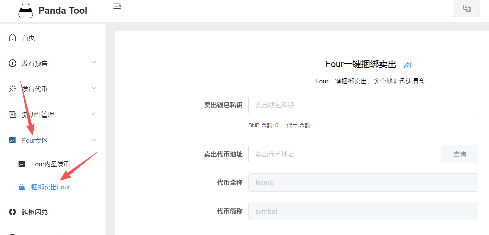
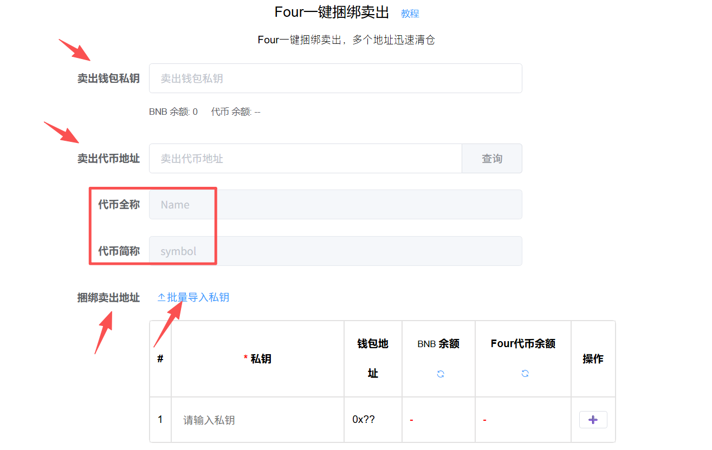
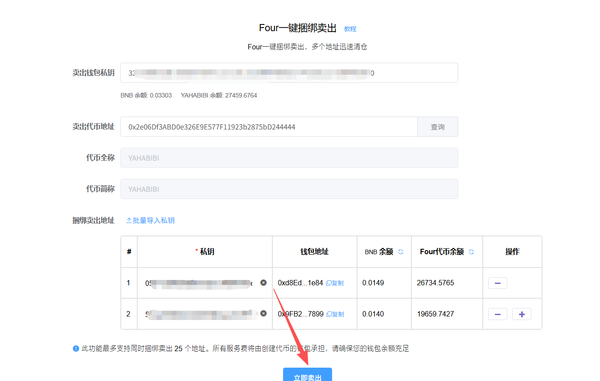
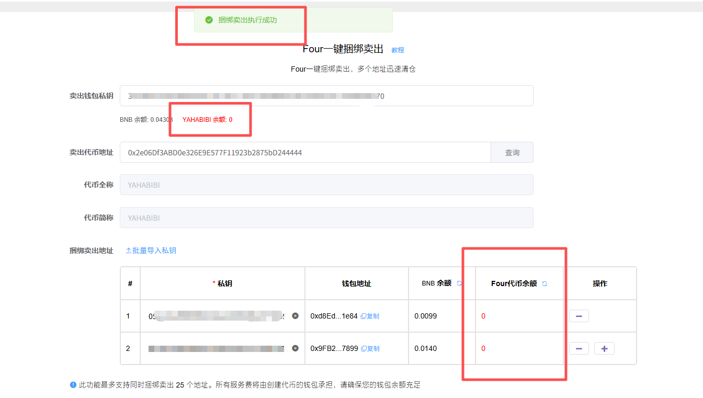

# Four.meme一键卖出清仓教程

#### 怎么理解Four的一键捆绑卖出这个功能？ 

我们假设这样一种情况，当你使用Four.meme捆绑买入功能在多个地址内买入代币，或者拉盘刷量期间操作多个地址买入代币后，想将这些地址里面的代币全部卖出，应该怎么办？

传统的方式就是三种：

* **第一种：**&#x624B;动卖。不断地切换钱包操作。这样不仅慢，而且机器人会跑在你的前面，不合适
* **第二种：**&#x673A;器人卖。通过我们的机器人可以自动化卖出，省去了手动操作的麻烦，但是速度跟不上
* **第三种：**&#x5F52;集后卖。将代币归集到一个地址后统一卖出。听起来比较合适，但也是麻烦，多了一步归集的操作

正是基于这个需求，PandaTool开发了FourMeme一键捆绑卖出的功能，导入钱包私钥后，即可**一次性将所有钱包内的Four代币全部卖出。**&#x76EE;前一次最多支持**25个**地址，如果钱包比较多，可以多导入几次。

### **Four一键捆绑卖出教程**

#### **1、配置卖出参数**

我们打开PandaTool开发的FourMeme一键卖出工具：[https://pandatool.org/#/sellfour?lang=zh-CN](https://pandatool.org/#/sellfour?lang=zh-CN)，或者在官网导航栏找到捆绑卖出的按钮

<figure><figcaption></figcaption></figure>

进入到Four一键捆绑卖出页面后，我们填写相关的参数

<figure><figcaption></figcaption></figure>

* **卖出钱包私钥：**&#x586B;写主钱包的私钥，用于支付捆绑费用
* **卖出代币地址：**&#x8F93;入Four代币合约地址，点&#x51FB;**`查询`**
* **代币全称：**&#x6839;据合约地址自动识别
* **代币简称：**&#x6839;据合约地址自动识别
* **捆绑卖出地址：**&#x9700;导入捆绑钱包私钥

<figure><figcaption></figcaption></figure>

### **2、立即卖出**

所有参数填写完成、钱包导入成功后，会如下图所示

<figure><figcaption></figcaption></figure>

之后我们点击立即卖出按钮，系统就会自动执行。几秒钟后，就会提示执行完成。Four代币的余额也是直接显示为0，说明已经清仓

<figure><figcaption></figcaption></figure>

至此，Four代币一键捆绑卖出的流程就全部结束了

### 疑问解答 

1. **一键捆绑卖出需要收费吗？**
   * **答：**&#x6BCF;个地址收费0.01BNB，这部分费用全部由导入的卖出钱包出
2. **一键捆绑卖出是卖出钱包内的所有代币吗？**
   * **答：**&#x6346;绑卖出是出售你输入合约地址的那个Four代币，其他代币是不受影响的
3. **卖出失败是怎么回事？**
   * **答：**&#x5927;概率是卖出钱包的BNB余额不足导致的。1个钱包0.01BNB，20个钱包至少需要0.21个BNB、根据捆绑的钱包数量不同，建议要存够足额的BNB
4. **我的私钥会泄露吗？**

* **答：**&#x50;andaTool永远不会以任何方式获取用户的私钥，所以您完全可以放心使用

如何您还有其他问题，都可以进入Telegram电报群找志愿者解答： [https://t.me/pandatool](https://t.me/pandatool)
