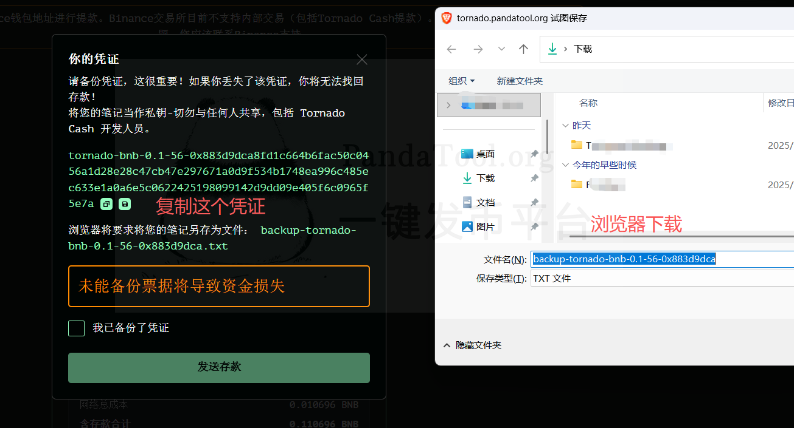
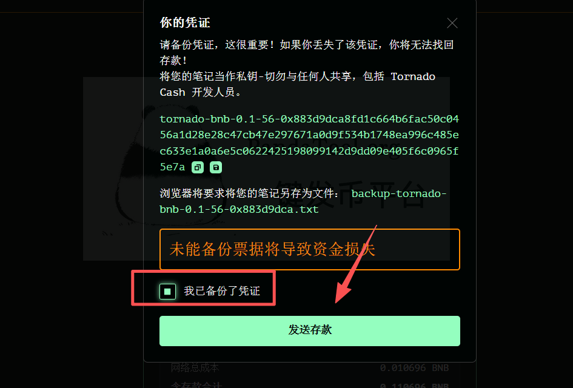
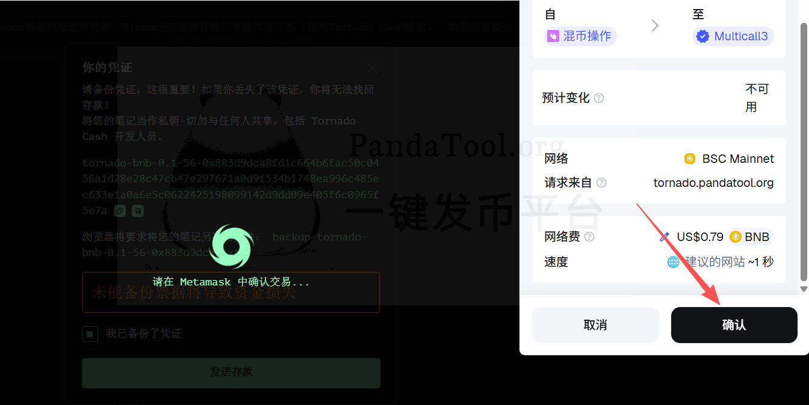
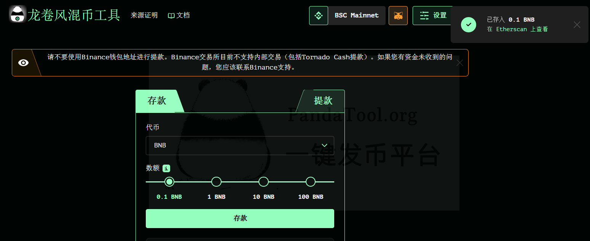
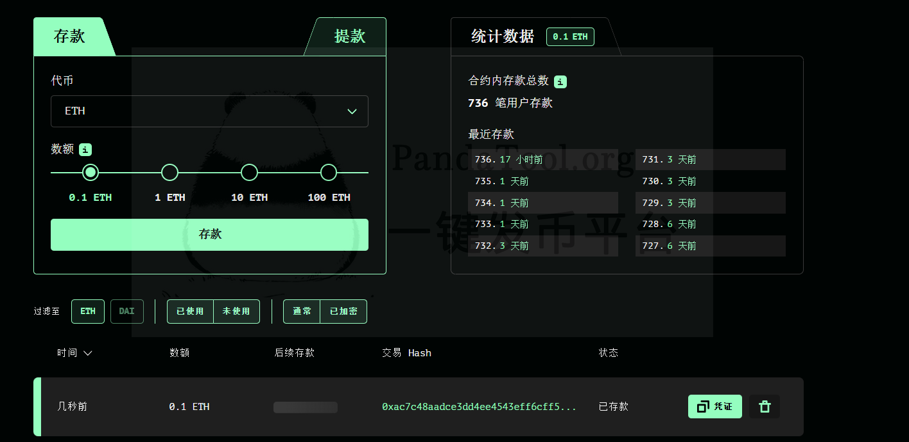
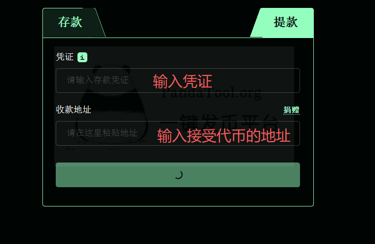
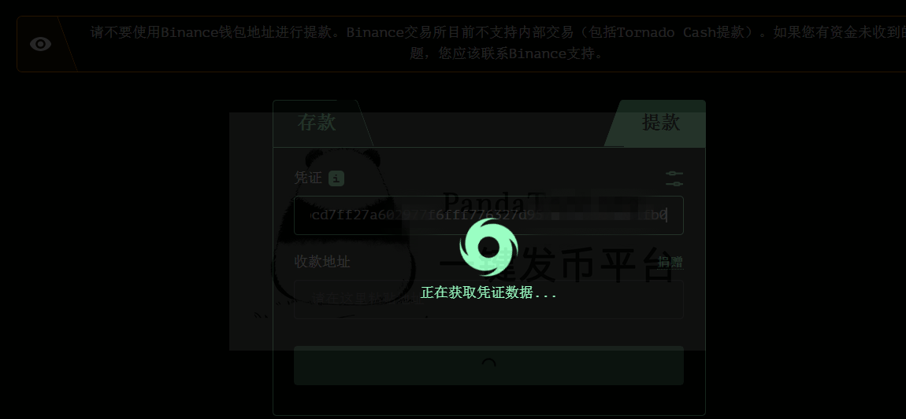
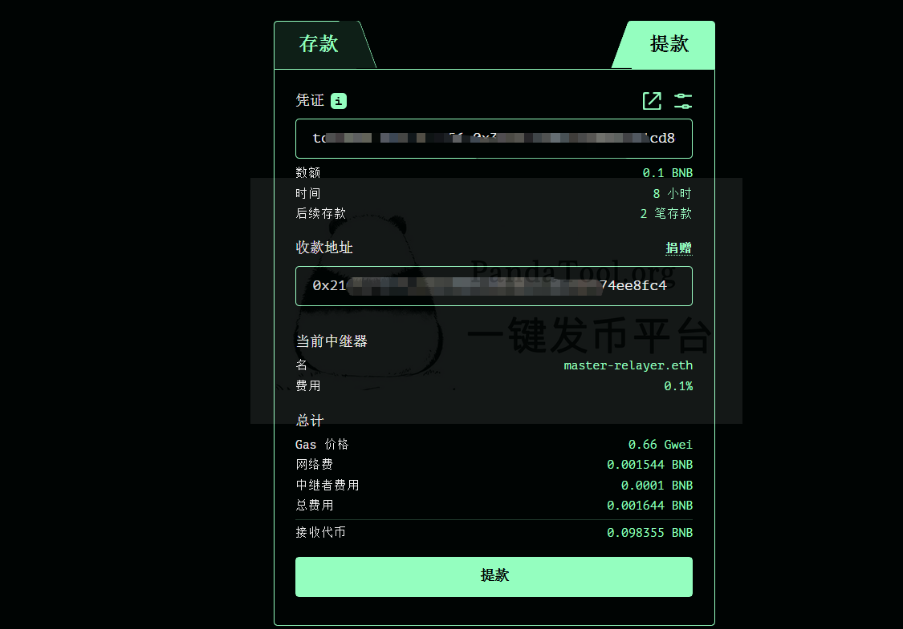
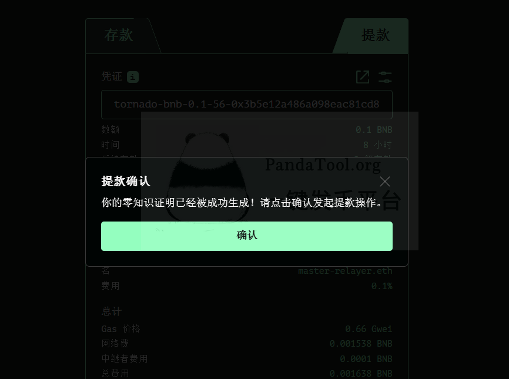

# 混币工具使用教程

Tornado Cash 也叫龙卷风， 于 2020 年推出，是一个运行在币安链、以太坊等区块链上的加密货&#x5E01;**“混币器”**，核心目的是帮助用户隐藏加密货币交易的来源和去向，提高交易隐私，避免被追踪。

2022 年 8 月，美国财政部 OFAC 将其列入制裁名单，冻结相关地址，因为它被用于洗钱。 但 2024 年 11 月法院裁决 OFAC 越权，2025 年 3 月 21 日制裁被解除，现在**美国用户可以合法使用Tornado Cash**。

_**注意：**&#x6DF7;币工具目前只支持币安链的**BNB混币**，更多区块链、更多代币正在开发中。_



### **Tornado Cash如何实现混币？**

它用零知识证明（zk-SNARKs）让人把钱存进一个“池子”，再从另一个地址取出，从而在链上切断「谁把钱给了谁」的直接可见关联，达到隐私保护的效果。

用个比喻：想象一个公共捐款箱，大家把钞票（加密货币）投进去，拿到一张“秘密票据”（像彩票号码）。过段时间，你用票据从箱子取钱，但箱子里的钱已经和别人的混在一起，外人根本分不清你的钱从哪来、去哪去。整个过程用“零知识证明”（zk-SNARKs）技术，确保你能证明“这是我的钱”而不泄露秘密。

简单来说，当别的用户追踪你的地址时，到最后只能看到你将代币存入了**Tornado Cash**的智能合约里，仅此而已。至于这个合约，每天都有人存款/取款。只要无法将存款地址和取款地址对应起来，就无法追踪到目标。

<figure><figcaption></figcaption></figure>

### **Tornado Cash的混币流程**

#### **第一步：存款（Deposit）**

* 按照要求存入固定金额的代币（如0.1BNB或者1BNB），连接钱包把钱投进去。系统在你浏览器里生成一个凭证秘钥，同时下载一个作为备份。你需要将这个秘钥妥善保存好，作为你的取款凭证。

#### **第二步：等待混合（Waiting）**

* 别急着取，等几天或几周，让更多人存钱进来。这样“匿名池子”越大，你的隐私越强——就像捐款箱里钱越多，越难追踪。

#### **第三步：取款（Withdraw）**

* 用一个新钱包（别用原来的），输入凭证秘钥。合约验证通过后，会由一个中继器将钱转到你指定的新地址，gas费由他支付。这样的话，你这个地址就是一个全新的了，与之前的地址没有任何关联。

### **混币工具使用教程**

很多人想使用Tornado Cash，却找不到入口。目前，PandaTool已经基Tornado Cash合约架构了完整的混币工具。于接下来，我将给大家详细演示，该如何操作混币工具。

#### **1、连接PandaTool混币工具**

首先，我们需要在电脑浏览器（或者是手机钱包里）打开PandaTool混币工具：[**https://tornado.pandatool.org/**](https://tornado.pandatool.org/)  之后，点击右上角连接钱包

<figure><figcaption></figcaption></figure>

连接成功后，能看到你的钱包地址（在连接之前，请将钱包切换到币安链BSC）

<figure><figcaption></figcaption></figure>

#### **2、确认存款金额**

接下来，你就可以选择要存入的代币金额。目前只支持BNB存款，一共有4个金额，分别是：0.1BNB、1BNB、10BNB以及100BNB。

选择好金额后，可以看到你需要支付的费用

<figure><figcaption></figcaption></figure>

看一下没有问题的话，就点击**存款**按钮

#### **3、备份凭证（秘钥）**

在你点击存款之后，浏览器会提示要让你备份（复制）凭证，同时下载一个文档作为备份。

<figure><figcaption></figcaption></figure>


这一步非常重要！！！

**一旦凭证丢失**，你将永远无法取回自己的资产！!

永远无法取回！永远无法取回！永远无法取回！永远无法取回！永远无法取回！永远无法取回！

永远无法取回！永远无法取回！永远无法取回！永远无法取回！永远无法取回！永远无法取回！

永远无法取回！永远无法取回！永远无法取回！永远无法取回！永远无法取回！永远无法取回！

一旦**凭证被盗取**，别人将可以盗取你的资产！！

资产将被盗取！资产将被盗取！资产将被盗取！资产将被盗取！资产将被盗取！资产将被盗取！

资产将被盗取！资产将被盗取！资产将被盗取！资产将被盗取！资产将被盗取！资产将被盗取！

资产将被盗取！资产将被盗取！资产将被盗取！资产将被盗取！资产将被盗取！资产将被盗取！


如果你已经妥善备份自己的凭证，就可以点击确认，然后点击发送存款

<figure><figcaption></figcaption></figure>

然后会跳出钱包让你确认支付

<figure><figcaption></figcaption></figure>

点击确定后，会提示你交易成功

<figure><figcaption></figcaption></figure>

并且在浏览器看到你的存款记录。（该记录主要是基于浏览器缓存出现的，一旦关闭，将自动清楚）

<figure><figcaption></figcaption></figure>

#### **4、操作提款**

有了存款凭证之后，大家可以等几天到几十天不等，然后就能取款了。

<figure><figcaption></figcaption></figure>

在取款页面输入凭证秘钥，以及接受代币的钱包，系统会获取凭证数据，并查找中继器

<figure><figcaption></figcaption></figure>

等待一会，就能看到您的提币信息，以及需要支付的相关费用

<figure><figcaption></figcaption></figure>

点击**提款**按钮后，再等待1到3分钟，混币器会核对您的凭证，让你再次确认

<figure><figcaption></figcaption></figure>

再次确认后，中继器就会开始操作，大概十几秒钟，就能实现提款了。

### **混币工具使用问答**

**1、凭证丢失或者没有备份秘钥，该怎么办？**

* 答：没有任何办法，这就意味着，你将永远无法提款，资产永久留在了龙卷风混币合约中

**2、提款时显示：没有可用的中继器是什么意思？**

* 答：您的代币是由中继器地址发给您的，gas费他来承担。有时候中继器不在线，或者过于繁忙，就需要等待一段时间再试试

**3、使用混币器需要收费吗？**

* 答：是的，当您存款时，每笔存款会收取**0.01BNB**的费用（不管多少金额，都是这个费用）。当您取款时，需要给**中继器**缴纳提款金额0.1%（千分之一左右）的费用。

**4、如何提高混币效果？**

* 答：当您的代币在混币池内留存的时间越久，效果越好。就像一个房间，进进出出的人越多，你就越不易被察觉。即便有监控视频，排查难度也会增长

**5、池子会不会跑路？**

* 答：不会，Tornado的合约早已运行多年，广受认可，池子是有安全性的，无须担心。

**6、混币器有什么潜在风险吗？**

* 答：当您使用混币器之后，您的钱包就相当于和混币器有过关联。有些交易所，会将与混币器有关联的地址拉黑。具体哪些交易所，不太好说。就是存在这种潜在的风险。这个问题也很好解决，混币之后通过正常的跨链桥到其他链上，再去DEX交易几笔就可以了。

**7、当前只支持BNB吗？**

* 答：是的，当前混币器还处于公测阶段，暂时现在币安链上使用。后面会拓展到其他公链，也会支持更多代币。BNB池子目前是使用比较频繁的。

当然，关于混币器如果您还有其他使用问题，可以进入我们的官方电报群了解：[https://t.me/pandatool](https://t.me/pandatool)
