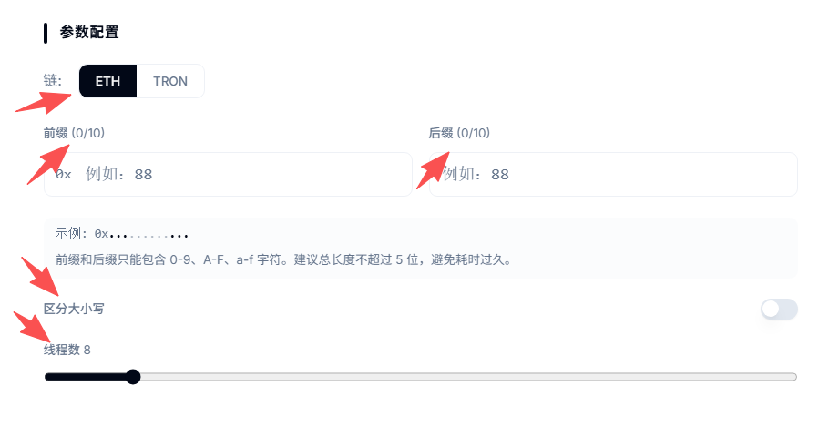
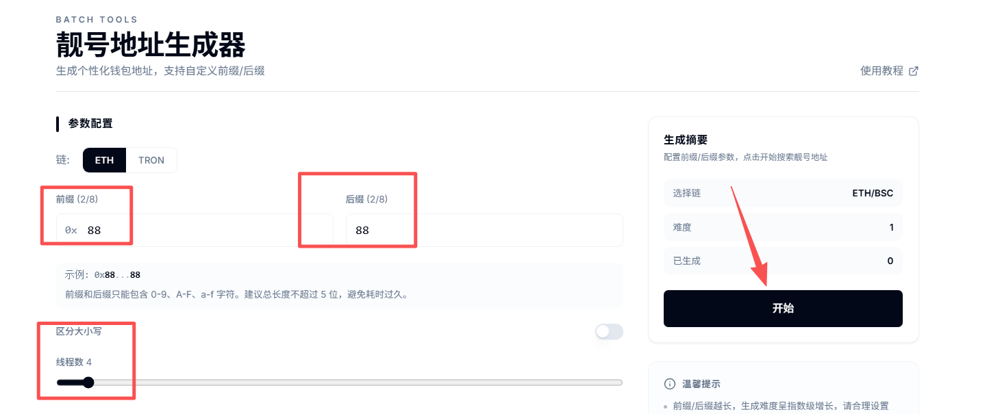
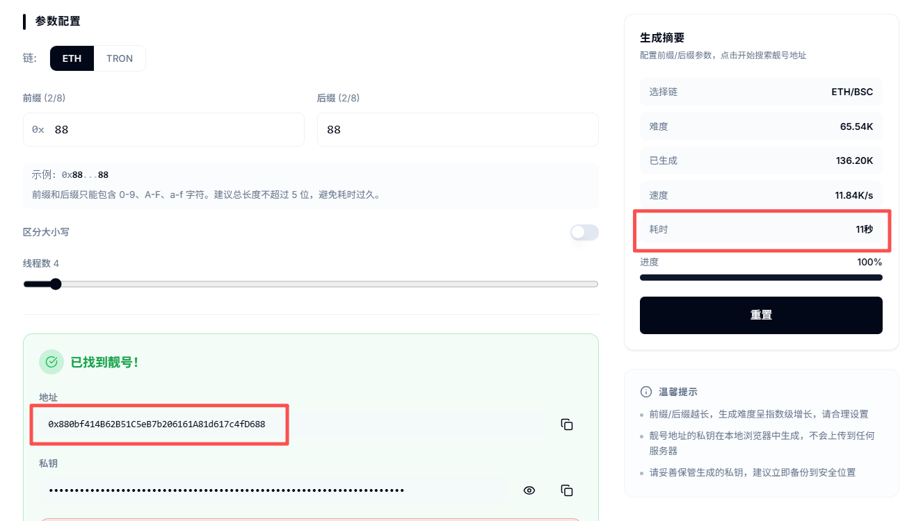

# 靓号地址生成器

### **靓号地址概念解答**

**1、什么是靓号地址？**

所谓靓号钱包地址，是指包含特定字符或规律的钱包地址，一般出现在钱包的开头或者结尾（如以特定字母开头，或包含连续的 666、888 等）。它本质上与普通地址同样安全，但外观更具个性化和识别性。

靓号地址的生成原理是通过PandaTool开发的专用生成器，通过循环创建大量随机私钥，逐一筛选匹配满足特定规则（如指定前缀或后缀）的地址，此过程不修改区块链底层数据，只利用概率优势找到稀有地址。

**2、靓号地址有什么用处？**

* 专属靓号地址可作为链上身份标识，方便KOL的粉丝以及合作伙伴快速、准确地找到收款地址，增强社交传播效果
* 靓号地址因易记易传播，常被用于接收投注、结算资金等灰色业务
* 打造独一无二的链上身份，比如用你的生日、名字缩写作为地址的一部分，在加密世界显得更专业、更有个性。
* 一个特定的、易记的后缀（如 ...8888 结尾），相比完全随机的地址，能降低看花眼复制错的可能性。

**3、靓号地址有哪些类型？**

* **纯数字前缀/后缀**：以重复或幸运数字开头或者结尾，如 `0x8888...`、`0x0000...`&#x20;
* **单词缩写后缀：**&#x5982; ...pump、...bonk、...sol 等
* **镜像/回文地址：**&#x524D;后对称，如 0x5b4d6554... 等特殊格式

**4、靓号地址支持哪些链**

* EVM链：如BSC、ETH、BASE、Arb等
* Tron链：就是波场链，TRC地址


我们不会存储私钥，请您自行保管，丢失后无法找回！！！

我们不会存储私钥，请您自行保管，丢失后无法找回！！！

我们不会存储私钥，请您自行保管，丢失后无法找回！！！


### 操作流程 

### **靓号地址生成教程**

PandaTool开发的靓号地址工具，是全网最强靓号地址生成器，可以生成多个数字的前后缀。具体该如何操作呢？

我们首先打开靓号地址生成工具的页面：[https://www.pandatool.org/zh-CN/batchtools/vanity](https://www.pandatool.org/zh-CN/batchtools/vanity) 然后按照要求配置参数

<figure><figcaption></figcaption></figure>

* **选择链：**&#x53EF;以生成ETH钱包还是TRON波场钱包。这个ETH钱包，就包括BSC，是一样的
* **输入前缀：**&#x53EF;以输入数字、字母等，自定义钱包地址的前缀
* **输入后缀：**&#x53EF;以输入数字、字母等，自定义钱包地址的前缀
* **区分大小写：**&#x70B9;开该按钮后，就意味着生成的地址区分大小写，不点开就意味着不区分
* **线程数：**&#x7EBF;程数决定了同时计算多少个候选地址，也意味着占用你电脑的多少CPU资源。线程数越大，占据的电脑资源越多（意味着你的电脑在搞其他事情的时候会越卡）

例如我填写的信息如下：

<figure><figcaption></figcaption></figure>

我打算生成一个ETH地址，前缀是88，后缀也是88，同时开4个线程，不影响我办公看电影。之后，点击开始按钮

<figure><figcaption></figcaption></figure>

可以看到，一共耗时11秒，就生成了一个地址。然后我复制私钥存储下来，就可以了。

### **靓号地址的问题解答**

**1、生成靓号地址要钱吗？**

* 答：完全免费。该生成器是PandaTool开发的免费引流工具，无需任何费用。

**2、生成靓号钱包私钥会泄露吗？**

* 答：所有的钱包均是在您的本地生成的，PandaTool是拿不到您的私钥的。您需要做的是，如何去保管自己的私钥，以及操作的时候周围是否有其他的人或者摄像头的等等。

**3、可以生成BSC靓号钱包吗？**

* 答：完全可以，BSC和ETH用的是同一套钱包地址/私钥，选择ETH生成的钱包，就是BSC钱包了。

**4、为什么不可以生成Solana靓号钱包地址？**

* 答：Solana靓号钱包地址不在这个页面，您可以去这里操作：[https://solana.pandatool.org/vanityAddress](https://solana.pandatool.org/vanityAddress)

**5、为什么我的靓号地址半天生成不出来？**

* 答：如果您设置的靓号数字较多、前后缀越长，或者较为复杂，则生成难度会很大，这样生成的就非常慢。此外，电脑越好、配置越高，生成的速度会更快。

如果您在生成靓号钱包的过程中，还有其他的一些问题，可以在Telegram群里咨询我们的志愿者：[https://t.me/pandatool](https://t.me/pandatool)
