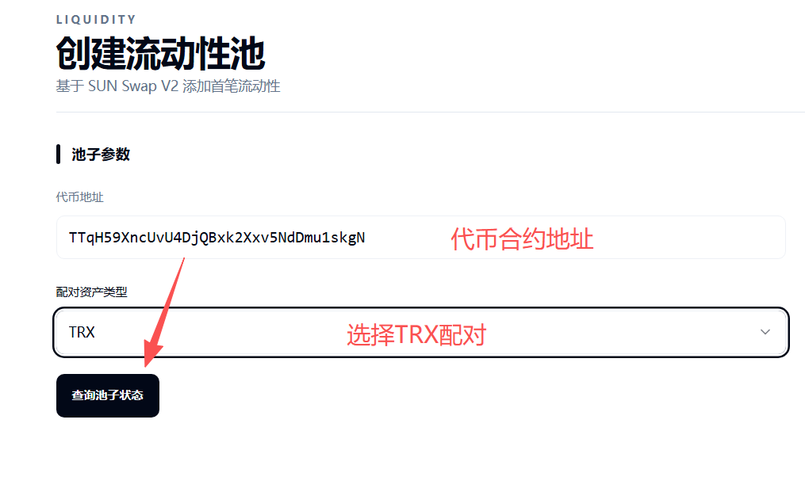
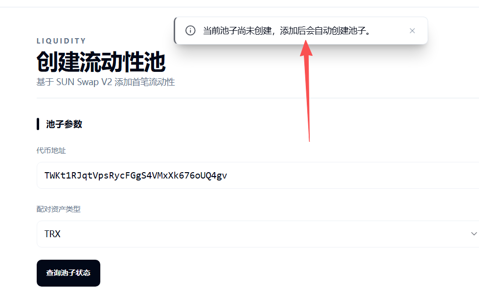
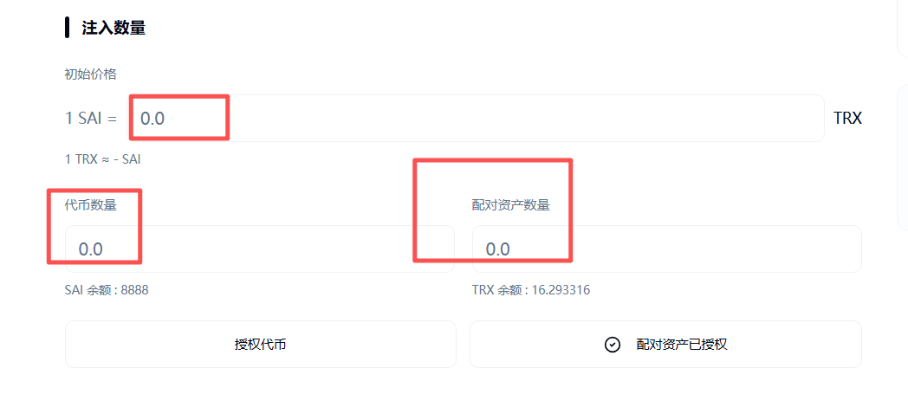
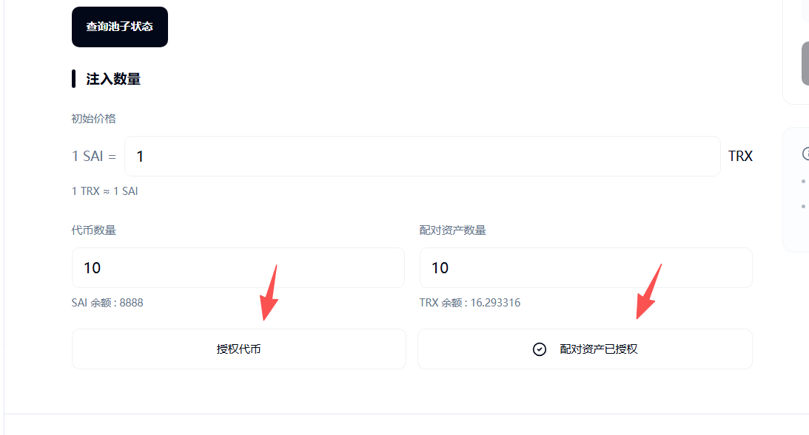

# 波场Tron代币创建流动性教程

### **一、流动性资金池解读**

**1、为什么要创建流动性资金池？**

* 答：为了让代币可以交易、可以有价格和价值。如果没有流动性资金池，代币只能转账，无法进行兑换，是没有意义的。

**2、代币交易后，在钱包里有价格或者价值吗？**

* 答：不一定，TP钱包、OKX钱包、TronLink钱包，每一个规则都不一样。我们很难预测该钱包是否会给代币显示价值。

**3、资金池里面的资金会被攻击，或者被平台拿走吗？**

* 答：完全不会。PandaTool只是提供一个创建前端，流动性本质是基于SunSwap构建的。您的资金存储在SunSwap里面，只要钱包私钥不被盗，就完全不用担心。

### **二、创建流动性资金池教程**

在创建流动性资金池之前，我们必须先创建一个代币。之后为这个代币创建流动性，之后按照以下流程操作

#### **1、连接钱包**

首先，我们打开流动性资金池创建页面：[https://tron.pandatool.org/zh-CN/liquidity/createv2](https://tron.pandatool.org/zh-CN/liquidity/createv2)  然后右上角连接TronLink波宝钱包，这个如果您之前创建过代币，应该都会

<figure><figcaption></figcaption></figure>

#### **2、查询池子**

接下来，我们输入代币合约地址，并且选择交易对，然后查询池子状态

<figure><figcaption></figcaption></figure>

_注意：这里不一定要选择TRX。如果你要做USDT的池子，就选择USDT。只是通常选TRX做池子比较多。_

点击查询池子状态后，一般会出现以下提示

<figure><figcaption></figcaption></figure>

这个查询结果的意思就是说：你这个币目前没有资金池，可以正常创建。如果有资金池的话，就无法创建，只能去管理了

#### **3、填入代币数量**

接下来，我们就需要填入代币数量

<figure><figcaption></figcaption></figure>

* **初始价格：**&#x4EE3;币的开盘价格。这个价格确定后无法修改。（填1，则表示1代币=1TRX，以此类推）
* **代币数量：**&#x5C31;是您创建的代币数量，土狗币数量。
* **配对资产数量：**&#x5C31;是价值币的数量，如USDT、TRX等。

注意，这两种代币你填多少，就放多少。比如TRX填1000，那钱包里至少得有1000个才行，否则放不进去。总得来说，池子里面的配对资产数量越多，流动性越强。

#### **4、授权代币**

代币数量和价格确定后，我们需要授权，将自己创建的代币和配对资产授权给SunSwap合约，以便接下来进行创建

<figure><figcaption></figcaption></figure>

#### **5、创建流动性**

授权完成后，我们点击创建流动性按钮，之后会弹出钱包进行确认。钱包确认后，就算是创建成功了

<figure><figcaption></figcaption></figure>

流动性资金池创建完成后，如果你觉得池子比较小，想增加一点。或者池子比较大，想撤出一点，都可以通过我们的流动性管理页面完成：[https://tron.pandatool.org/zh-CN/liquidity/lpmanage](https://tron.pandatool.org/zh-CN/liquidity/lpmanage)

### **三、流动性池疑问解答**

**1、资金池创建好之后，在哪里交易？**

* **答：**&#x901A;常来说，可以去Sunwap交易：[https://sunswap.com/#/home](https://sunswap.com/#/home)

**2、能否创建稳定币池？或者单币池？**

* **答：**&#x76EE;前不行，PandaTool目前只支持创建SunSwap V2流动性池，该类型资金池的代币价格存在涨跌，且是双币流动性。关于稳定币池，后期我们会进行开发。

**3、创建资金池的费用是多少？**

* **答：**&#x5C31;我们平台来说，每次创建会收取200TRX的费用，用户本身还需要支付创建能量费用，以及SunSwap的费用。总得来说，手续费可能在数百到上千TRX不等。

如果您对创建波场代币资金池还有什么其他的疑问，欢迎进入PandaTool交流群，志愿者会给您解答：[https://t.me/pandatool](https://t.me/pandatool)
