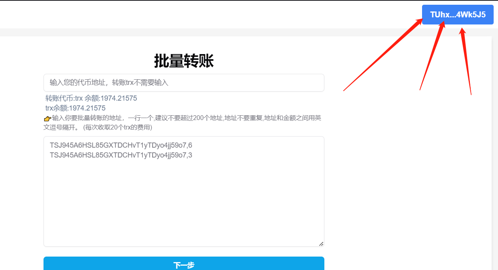
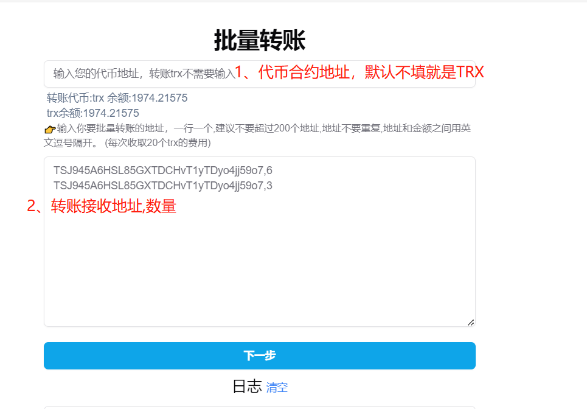
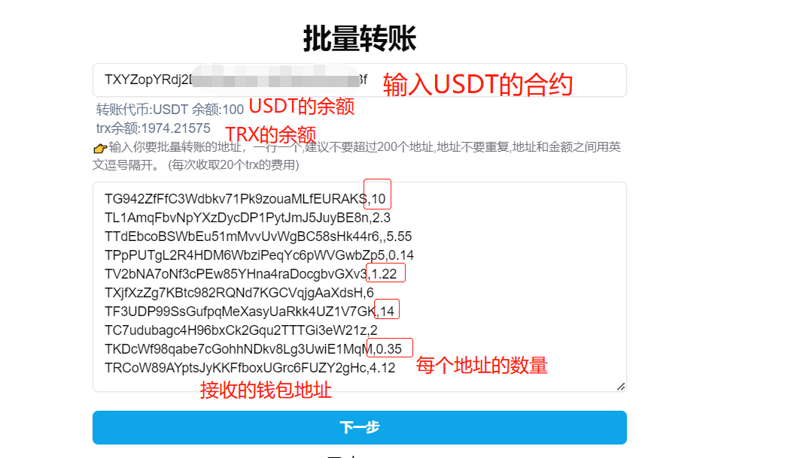
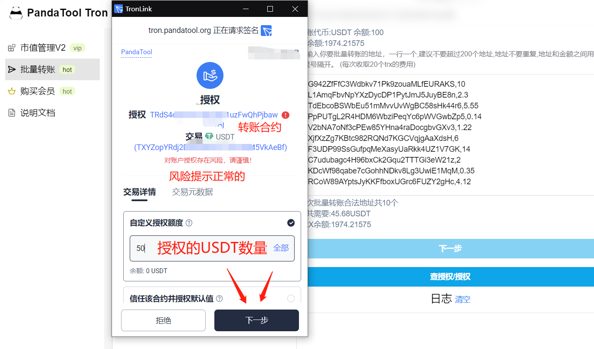
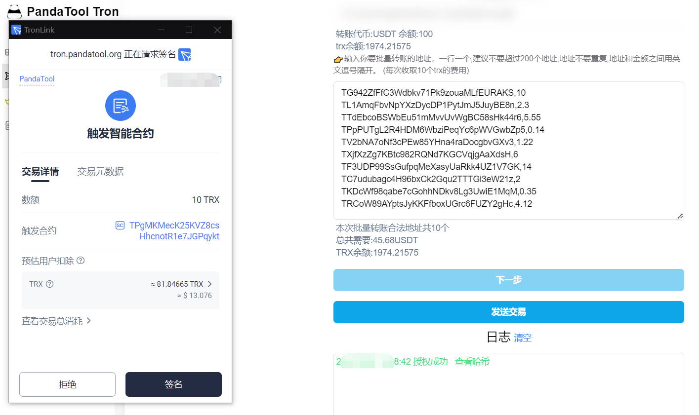

# 波场Tron批量转账工具教程

波场批量转账工具是什么？顾名思义，就是批量转账波场链上的代币，包括TRX、USDT、SUN等等。通过批量转账，可以快速将某个地址内的代币传递到多个不同的地址。

相比较一次次转账来说，批量转账极大地节省了操作的时间。一次转200个地址，和转200次，所花费的时间和精力是不可对比的。此外，批量转账所消耗的能量，也会低很多。

接下来，PandaTool将给大家演示一下，具体该如何使用工具进行批量转账操作


波场链的批量转账，需要消耗能量。尤其是转USDT这种代币，消耗的能量非常惊人。大家在操作之前，建议先购买足够的能量。购买地址：[https://feee.io/?ic=8ZL9](https://feee.io/?ic=8ZL9)


### 一、连接波宝钱包

我们打开波场批量转账工具的链接：[https://tron.pandatool.org/multisend](https://tron.pandatool.org/multisend) ，点击右上角连接钱包。（请先确保自己的浏览器已经安装了波宝钱包，如果没有，请查阅 → [TronLink波宝钱包安装教程](tronlink.md)）

<figure><figcaption>
链接钱包
</figcaption></figure>

之后TronLink会跳出来让你确认，点击**连接**就可以了

<figure><figcaption>
点击连接
</figcaption></figure>

连接成功后，右上角会显示出你的钱包地址，此时就可以进入到下一步了

<figure><figcaption>
批量转账地址
</figcaption></figure>

### 二、填写转账信息

接下来，我们需要填写转账信息，包括：转账的代币、转账的地址以及每个地址的接收数量

<figure><figcaption></figcaption></figure>

例如，我要转账USDT给到10个钱包地址，每个钱包不固定数量，填写后就是下图的样子

<figure><figcaption></figcaption></figure>

信息确认完成后，我们点击下一步。此时工具会告知你要转账的地址数以及要转账的代币总量，我们需要再次核对确认无误后，点击**查授权/授权**按钮

<figure><figcaption></figcaption></figure>

如果您是第一次操作，那么此时钱包会提示让你进行授权，我们点击确认即可（授权只发生在USDT这样的代币上，批量转账TRX是不需要授权的）

<figure><figcaption></figcaption></figure>

这里我们需要填写自己要授权的USDT数量，或者不用自定义，直接选择默认值也可以。但不管如何，都要保证填写的数量要大于此次转账的数量。

授权信息写好之后，我们点击下一步，此时会让你进行一个签名授权，并再次确认签名

<figure><figcaption>
签名授权
</figcaption></figure>

<figure><figcaption>
确认授权
</figcaption></figure>

授权确认完成后，日志会有相关提示，此时我们就可以点击**发送交易**了，之后会弹出钱包确认即可完成。

<figure><figcaption></figcaption></figure>

### 三、疑问解答

**1、授权有风险嘛？**

* 答：批量转账的功能是通过合约实现，即：将钱包内的代币授权给合约，合约发起转账的时候，从你的钱包内调取这些代币给到接收地址。因此，授权的风险在于平台。如果我们平台有风险，那么授权就有风险。如果我们平台不跑路或者被攻击，那就没有风险

**2、批量转账一次最多能转多少个地址？**

* 答：我们建议一次转账的地址数量不要超过200个，以保证工具的稳定性

**3、转账一次大概消耗多少能量？**

* 答：批量给10个地址转账USDT大概消耗38.4万能量，燃烧82TRX

如有大家还有不明白或者不清楚的地方，请加入官方电报Telegram群：[https://t.me/PandaTool](https://t.me/PandaTool)
