# 波场Tron批量转账工具教程

波场批量转账工具是什么？顾名思义，就是批量转账波场链上的代币，包括TRX、USDT、SUN等等。通过批量转账，可以快速将某个地址内的代币传递到多个不同的地址。

相比较一次次转账来说，批量转账极大地节省了操作的时间。一次转200个地址，和转200次，所花费的时间和精力是不可对比的。此外，批量转账所消耗的能量，也会低很多。

接下来，PandaTool将给大家演示一下，具体该如何使用工具进行批量转账操作


波场链的批量转账，需要消耗能量。尤其是转USDT这种代币，消耗的能量非常惊人。大家在操作之前，建议先购买足够的能量。购买地址：[https://feee.io/?ic=8ZL9](https://feee.io/?ic=8ZL9)


### 一、连接波宝钱包

我们打开波场批量转账工具的链接：[https://tron.pandatool.org/zh-CN/multisend](https://tron.pandatool.org/zh-CN/multisend) ，点击右上角连接钱包。（请先确保自己的浏览器已经安装了波宝钱包，如果没有，请查阅 → [TronLink波宝钱包安装教程](tronlink.md)）

之后TronLink会跳出来让你确认，点击**连接**就可以了

<figure><figcaption></figcaption></figure>

连接成功后，右上角会显示出你的钱包地址，此时就可以进入到下一步了

<figure>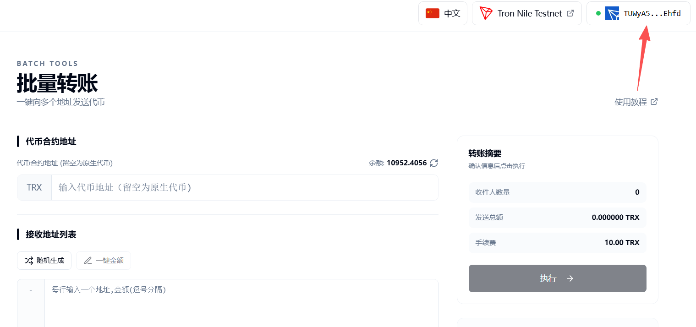<figcaption></figcaption></figure>

### 二、填写转账信息

转账信息，主要包括转账代币地址、接受地址以及接受数量三个方面组成，我们分别来看

#### **1、代币合约地址**

我们首先需要输入代币合约地址，你要转账什么就输入什么。注意，如果要转TRX，就不用填任何信息

<figure>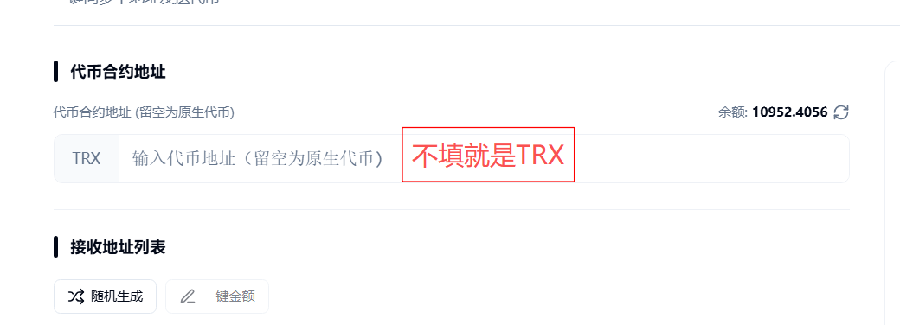<figcaption></figcaption></figure>

如果您要转账TRX，直接留空，什么都不要填。如果你要转账自己的土狗币或者USDT等，就需要填入相对应的代币地址

<figure>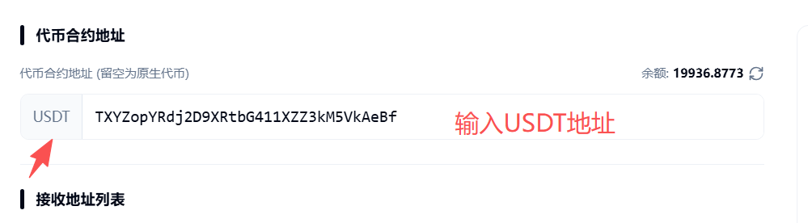<figcaption></figcaption></figure>

#### **2、接收地址**

接下来，就是填写要接受代币的钱包地址了。地址和数量以英文逗号隔开，每行一组，为保证转账效果，一次最好不要输入超过100个地址

<figure>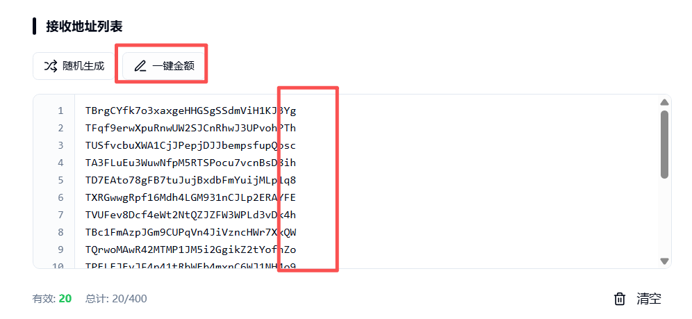<figcaption></figcaption></figure>

如上图可以看到，我输入了地址，但是没有输入数量，可以通过**一键金额**的方式，将数量直接填入、支持统一金额以及按照金额范围随机填写，非常方便

<figure>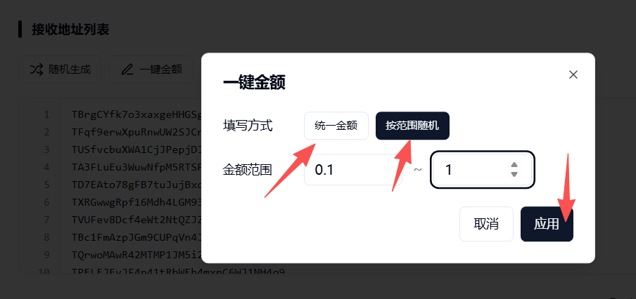<figcaption></figcaption></figure>

填好之后，就如下图所示。一定要注意，地址要和金额用**英文逗号**隔开

<figure>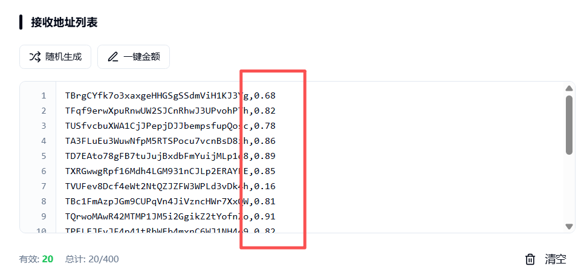<figcaption></figcaption></figure>

还有一种情况，假设你自己只是想增加代币的持仓地址数量，并没有真实的地址，也不需要。那么就可以通过**随机生成**这个按钮，自动生成地址和数量，然后进行一键空投即可

<figure>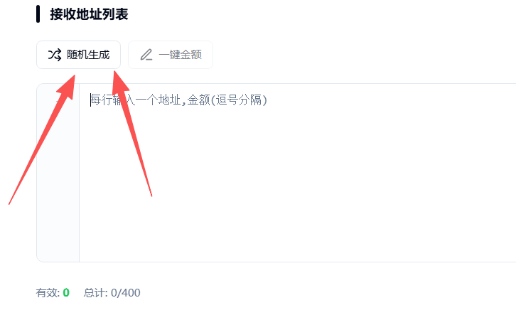<figcaption></figcaption></figure>

可以自动填写数量和金额范围

<figure>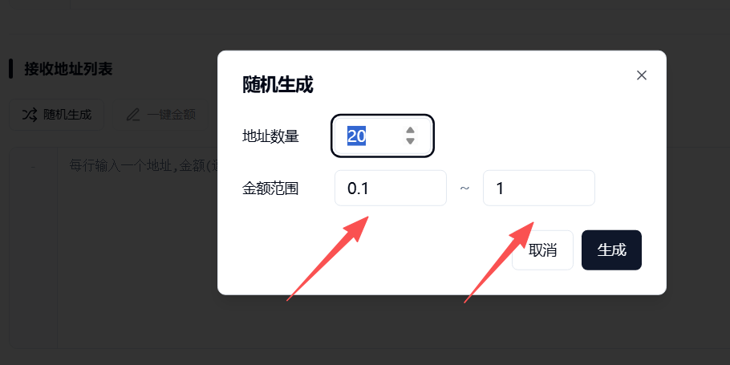<figcaption></figcaption></figure>

#### **3、代币授权**

接下来，你能看到你要转账的所有地址以及详细信息。如果你的代币没有授权，就需要点击授权。

<figure>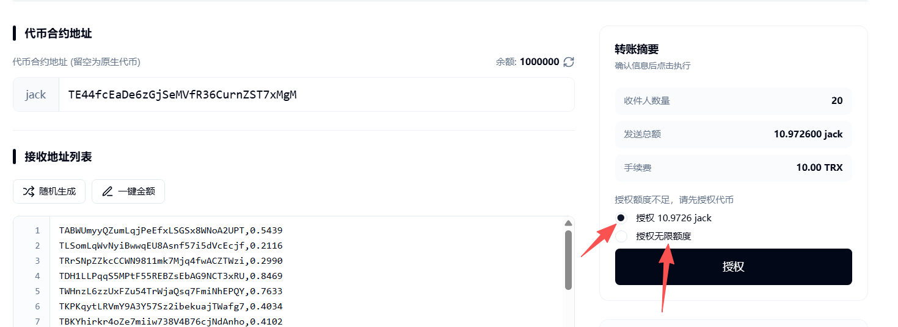<figcaption></figcaption></figure>

授权方式有两种：第一种，就是授权此次转账的额度。假设您这次转账6.17枚代币，就授权这么多。等到下次转账的时候，再授权。第二种就是授权无限额度，这样下次转账就无需授权了。

两种方式都没问题，可以自由选择。授权完成后，会进行提示

<figure>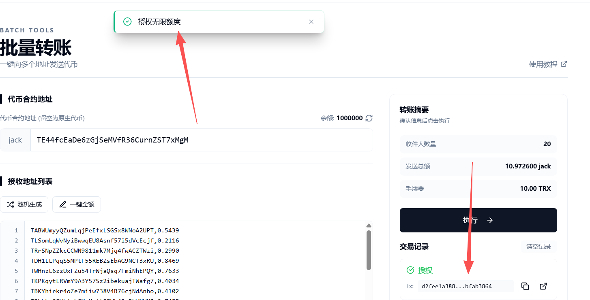<figcaption></figcaption></figure>

#### **4、执行批量转账**

确认撰写信息没有问题之后，就点击执行按钮，会弹出钱包，确认后即可完成

<figure>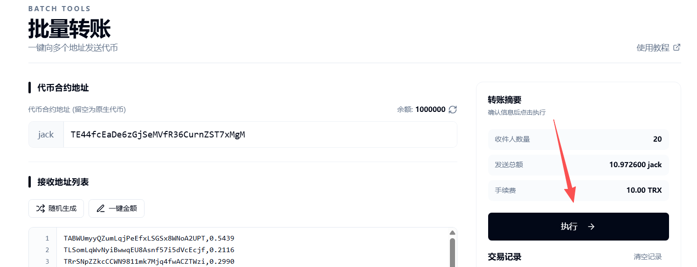<figcaption></figcaption></figure>

执行成功后，日志会有相应的记录和哈希

<figure>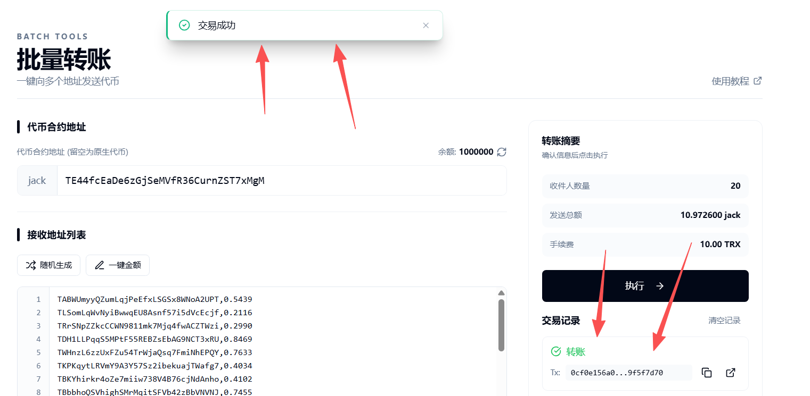<figcaption></figcaption></figure>

### 三、疑问解答

**1、授权有风险嘛？**

* 答：批量转账的功能是通过合约实现，即：将钱包内的代币授权给合约，合约发起转账的时候，从你的钱包内调取这些代币给到接收地址。因此，授权的风险在于平台。如果我们平台有风险，那么授权就有风险。如果我们平台不跑路或者被攻击，那就没有风险

**2、批量转账一次最多能转多少个地址？**

* 答：我们建议一次转账的地址数量不要超过200个，以保证工具的稳定性

**3、转账一次大概消耗多少能量？**

* 答：批量给10个地址转账USDT大概消耗38.4万能量，燃烧82TRX

如有对于波场批量转账代币还有什么疑问的话，请加入官方电报Telegram群：[https://t.me/PandaTool](https://t.me/PandaTool)
