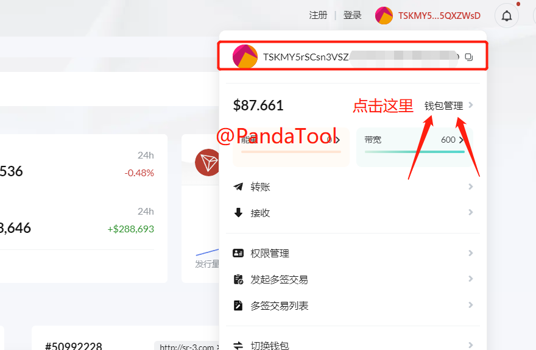
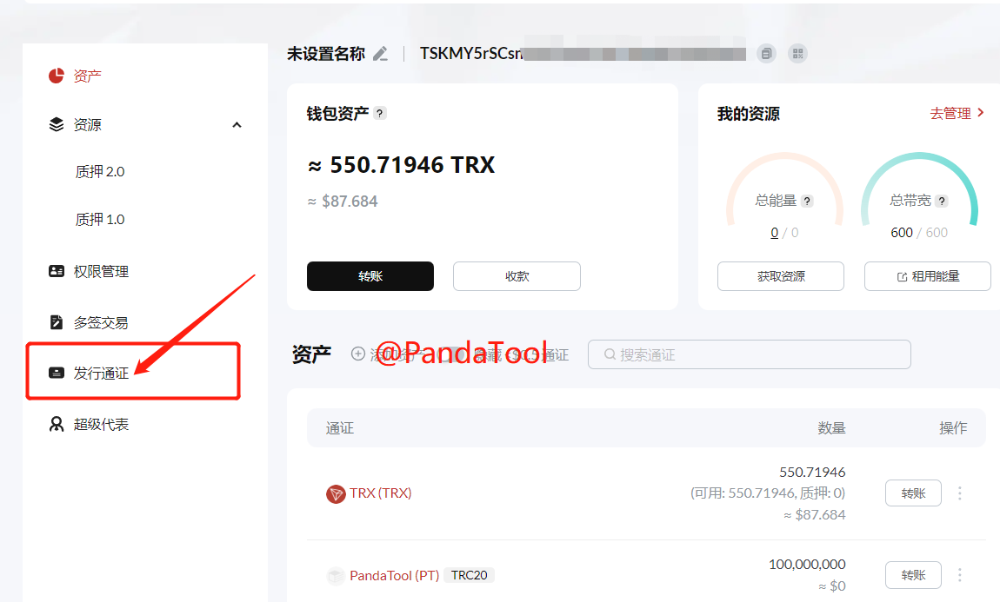
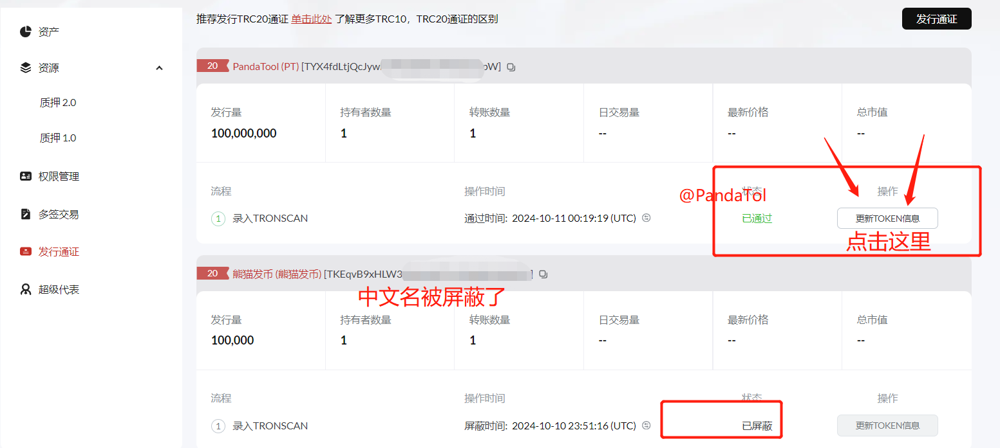
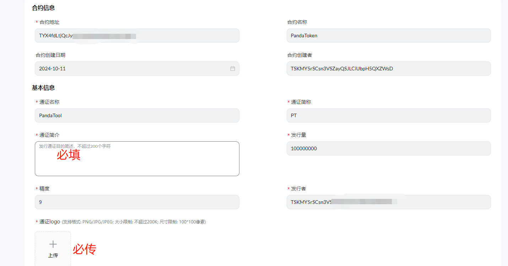
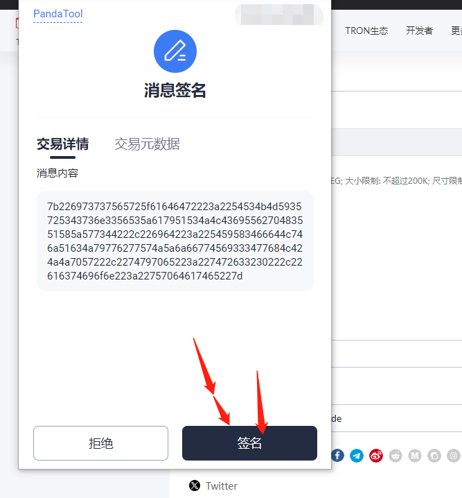
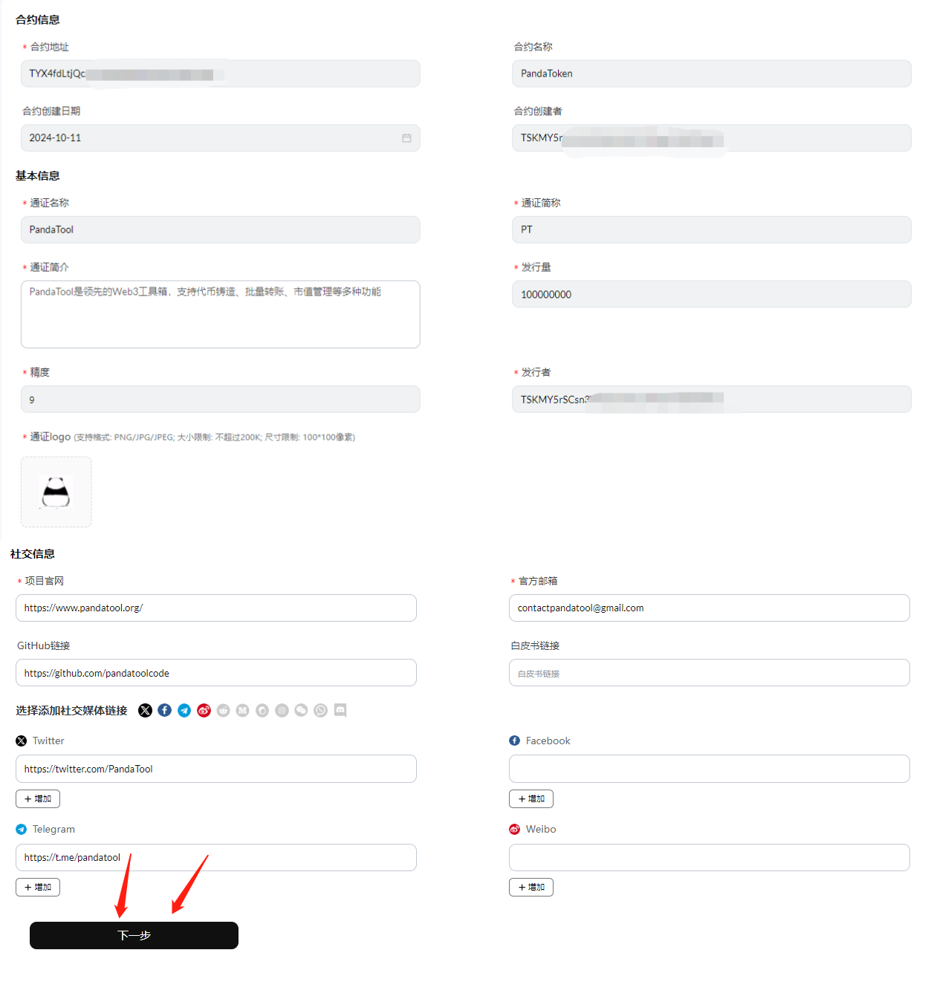
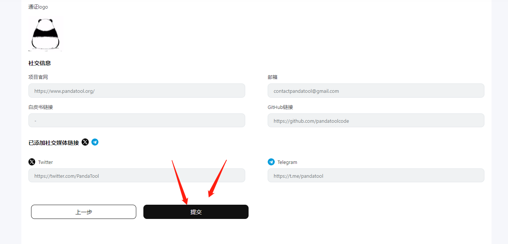
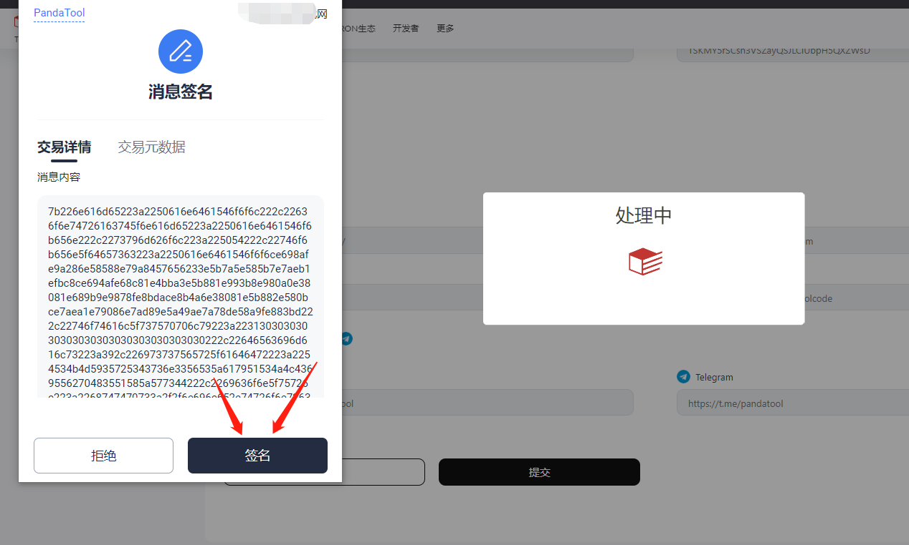
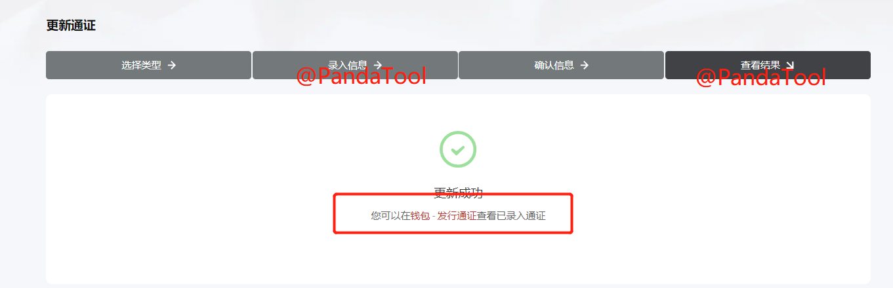

# 波场代币信息录入教程

资料信息录入，简单来说就是把代币的logo、简介、社交媒体等信息上传到波场浏览器中，让整个项目显得更加正规、合理。尤其是logo上传之后，可以在波宝钱包显示，还是很有用的。

接下来，PandaTool将详细告诉大家该如何录入代币


中文代币、假U、风险代币等，不支持录入，会被浏览器屏蔽


### 一、找到发行的代币

和[合约开源](https://help.pandatool.org/tron/verify)一样，我们同样要进入波场官方的浏览器：[https://tronscan.org/](https://tronscan.org/) ，并依次进行中文设置、钱包连接等操作，这部分就不展开了。

钱包连接完成后，我们点击右上角钱包地址的位置，选择**【钱包管理】**

<figure><figcaption></figcaption></figure>

之后，可以看到自己的钱包信息，包括能量什么的，我们点击左侧的**【发行通证】**

<figure><figcaption></figcaption></figure>

此时你能看到自己钱包内发行的所有代币，如果你想录入哪个代币，就选择哪个代币，点击**【更新Token】**信息

<figure><figcaption></figcaption></figure>

### 二、更新代币信息

我们点击更新Token信息后，会让你选择通证类型，默认就是TRC20，我们直接点击下一步，会看到更新通证信息的页面

<figure><figcaption></figcaption></figure>

这个页面里面的大部分信息都已经自动录入，我们只需要填写带星号的信息就行，那个必填的，具体有以下几样：

* **通证简介：**就是你的代币简介/介绍，不超过200个字符
* **通证logo：**就是你的代币logo，注意尺寸和大小（100\*100）
* **项目官网：**必须给一个链接（可以不是自己的）
* **官方邮箱：**必须给一个邮箱（可以不是自己的）
* **社交媒体：**可以填可以不填

这里面所有的资料就logo上传起来麻烦点，需要按照他的要求搞定尺寸，然后上传的时候，钱包需要确认签名一下，如下图

<figure><figcaption></figcaption></figure>

总得来说，代币的资料越全面，相对应的评分就高，例如为PandaTool填写的资料

<figure><figcaption></figcaption></figure>

确认填写的信息无误后，我们点击下一步，进行**资料提交**

<figure><figcaption></figcaption></figure>

点击提交按钮后，会弹出钱包进行签名确认

<figure><figcaption></figcaption></figure>

等待几秒钟后，就会提示你更新成功了

<figure><figcaption></figcaption></figure>

但请注意，这只是浏览器给的提示。事实上这个数据可能还没有更新完成。我们需要等待十几分钟，再去查看代币，就会发现资料已经上传了

### 三、疑问解答

1、合约更新资料需要付费吗？

* **答：**不需要，上传logo和资料不会收取任何费用

2、任何人都能更新资料信息吗？

* **答：**不是的，只有发币的钱包地址才有权限更新

3、为什么更新后钱包和浏览器还是看不到logo？

* **答：**数据的传输需要花点时间，大概等待15分钟到30分钟，就可以看到了

如果您有其他问题，还可以进入Telegram电报群找志愿者解答： [https://t.me/pandatool](https://t.me/pandatool)
