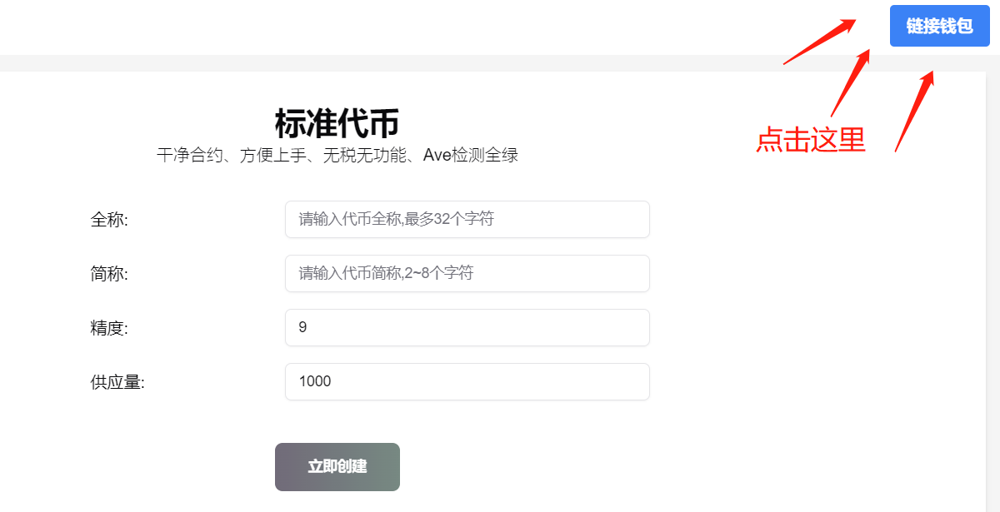
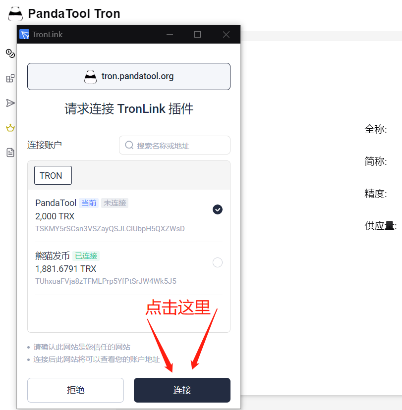
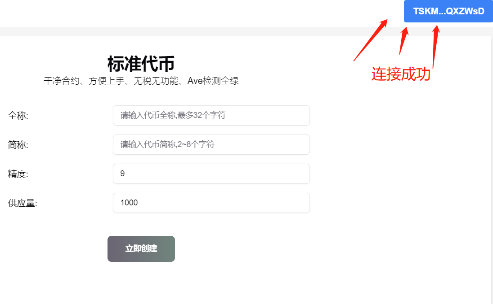
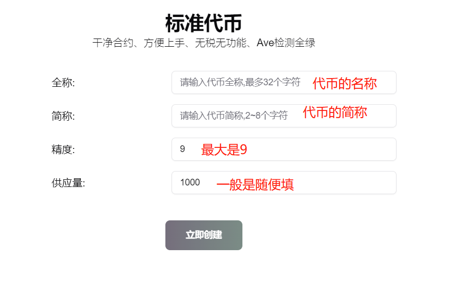
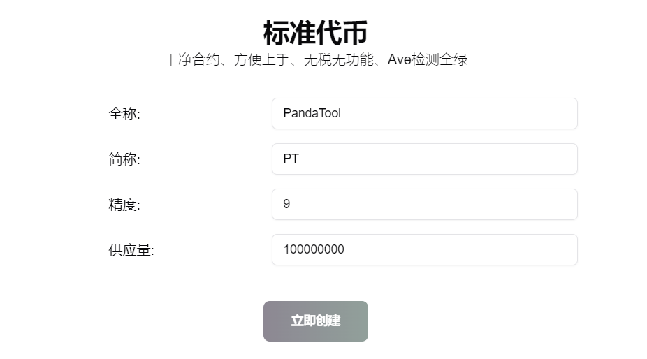
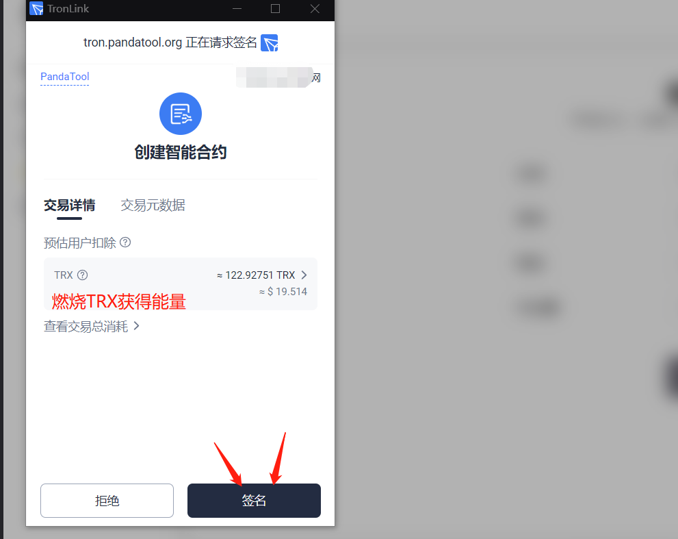
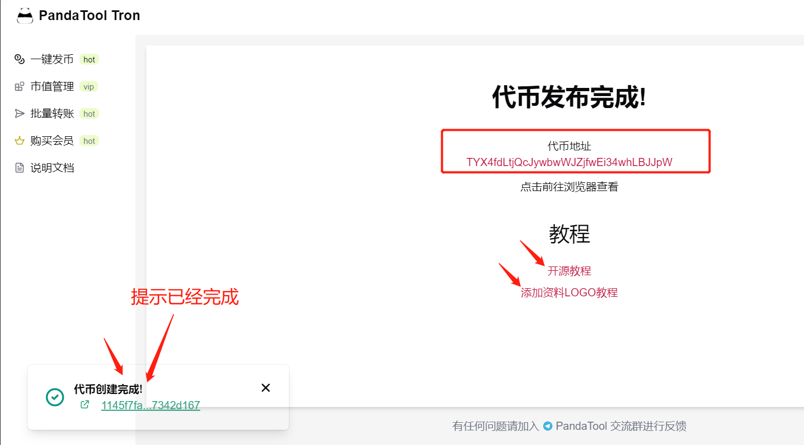

# 波场Tron一键发币教程

## 一、波场发币前提条件

* 发币之前请安装TronLink钱包，可以看 → [波宝钱包安装教程](tronlink.md)
* 钱包内最少准备**800TRX**（最好还有60万能量）
* 手机发币可以使用TP钱包或欧易Web3钱包
* 本教程针对的是TRC20代币，不包括TRC10代币

## 二、波场发币流程

* 1、连接波宝钱包
* 2、填写代币参数信息
* 3、钱包确认并支付费用
* 4、发币成功

接下来就每一步，给大家做详细的介绍

### 1、连接钱包

所有发币的教程第一步，就是连接钱包。我们首先打开波场一键发币的网址：[https://tron.pandatool.org/](https://tron.pandatool.org/) ，点击右上角链接钱包

<figure><figcaption></figcaption></figure>

此时会跳出波宝钱包提示，按照提示点击连接就可以了

<figure><figcaption></figcaption></figure>

连接成功后，右上角会出现钱包地址，说明就可以进入下一步了

<figure><figcaption></figcaption></figure>

### 2、填写代币参数

今天我们教学的只有标准币，所有参数非常简单，就是4个：全称、简称、精度和供应量

<figure><figcaption></figcaption></figure>

* **全称：**不超过32个字符，建议英文（注意：中文代币可能会被屏蔽）
* **简称：**不超过16个字符，建议英文（注意：中文代币可能会被屏蔽）
* **精度：**最大为18，最小为1
* **供应量：**只要数字不是特别离谱，是没有上限的

例如，我要发行一个名为PandaTool的，简称叫：PT，那么就填写成下面这样

<figure><figcaption></figcaption></figure>

### 3、钱包确认并支付费用

确认填写的信息无误后，点击“立即创建”按钮，会弹出钱包让你签名确认

<figure><figcaption></figcaption></figure>

在钱包确认页面，大家可以看到一笔TRX消耗。这个消耗，主要是用来进行燃烧获得能量的。发个币需要消耗大概56\~60万左右的能量，燃烧大概122个TRX可以获得这些能量。**如果钱包内能量充足，这笔TRX的费用就可以省去。**

当我们点击签名后，等待几秒钟，发币就完成了

<figure><figcaption></figcaption></figure>

在发币成功的页面，可以看到你的代币地址。至此，整个代币发行工作就算是完成一半了。

接下来，您可以继续进行代币的开源和资料添加，参考以下教程

* **波场代币合约开源教程：**[https://help.pandatool.org/tron/verify](https://help.pandatool.org/tron/verify)
* **波场代币添加logo教程：**[https://help.pandatool.org/tron/record](https://help.pandatool.org/tron/record)

## 三、波场发币疑问解答

1、发行的代币有功能吗？有权限吗？

* **答：**目前发行的是标准币，是没有权限、没有任何功能的普通代币

2、波场发币收费收多少？

* **答：**发行一个代币的收费价格是600TRX

3、发行的币可以开源吗？

* **答：**无法自动开源，只能手动开源，参考教程：[https://help.pandatool.org/tron/verify](https://help.pandatool.org/tron/verify)

4、怎么添加代币logo？

* **答：**需要在波场浏览器录入代币资料，参考教程：[https://help.pandatool.org/tron/record](https://help.pandatool.org/tron/record)

5、代币名称可以是中文吗？

* **答：**中文代币会被波场浏览器屏蔽，非常不建议使用中文命名

任何问题，都可以进入Telegram电报群找志愿者解答： [https://t.me/pandatool](https://t.me/pandatool)
