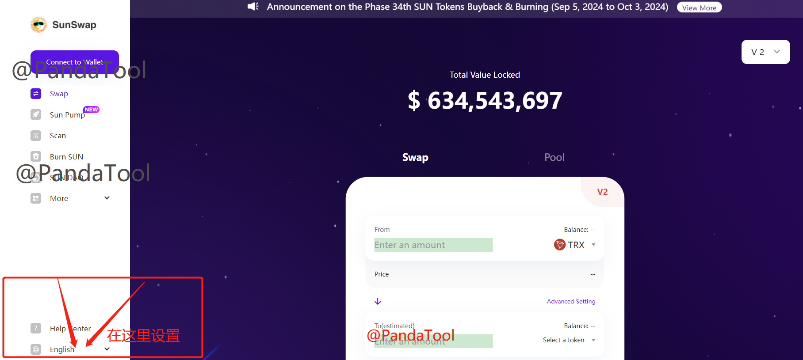
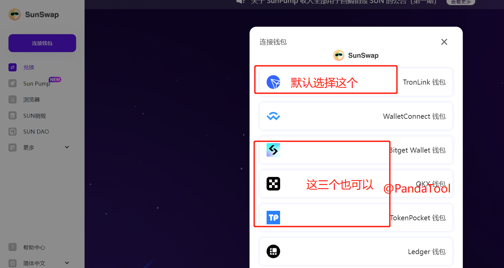
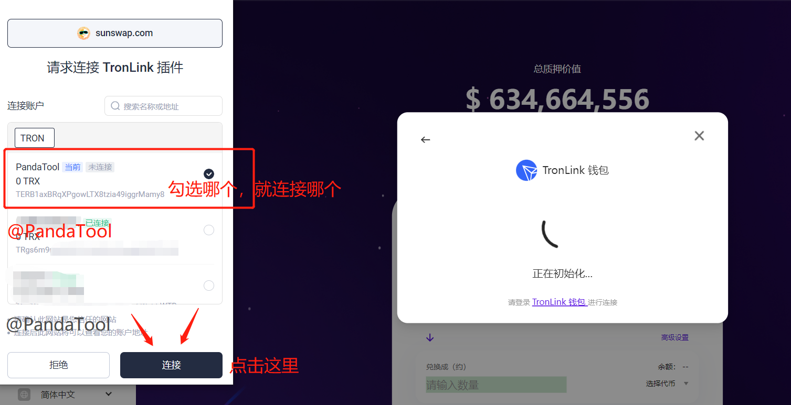
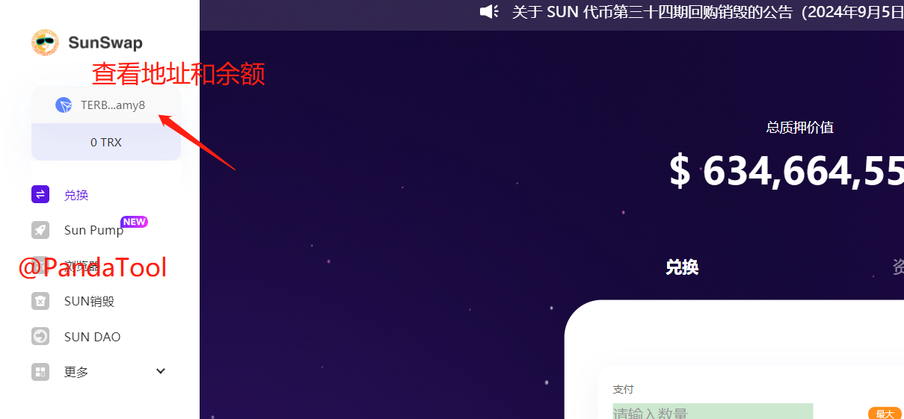
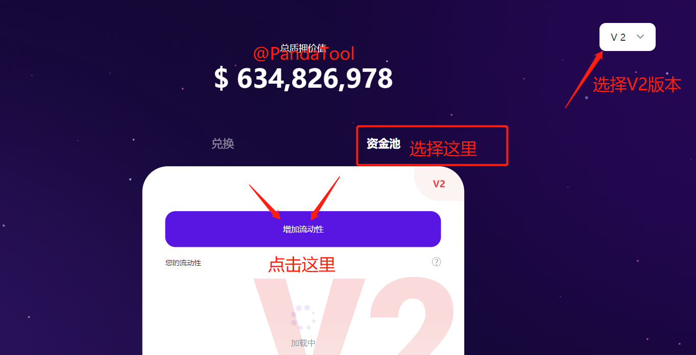
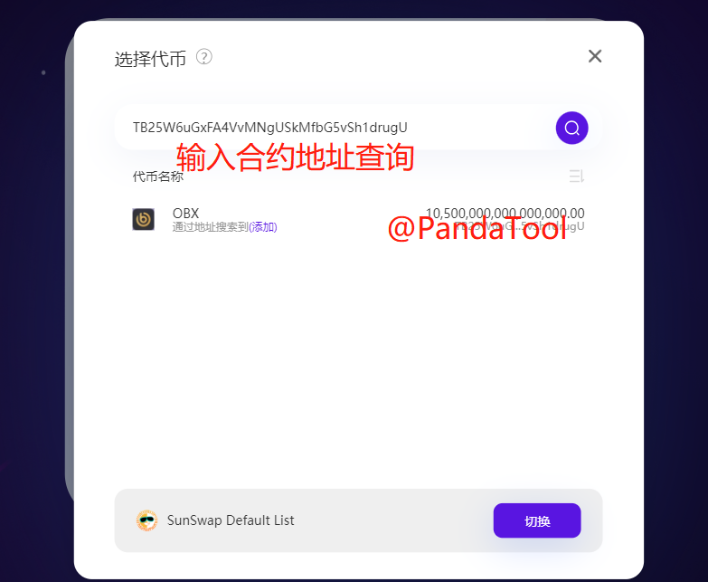
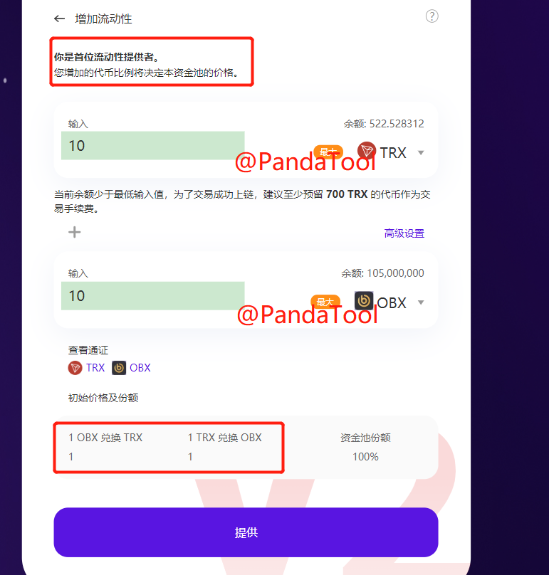

# SunSwap做流动性资金池子教程

SunSswap是波场TRON链最大的DEX，好像也是唯一一个？集波场TRON链上通证交换、流动性挖矿、稳定币兑换质押及平台自治功能于一体。基本上所有的TRC20代币要做池子，都需要在SunSwap创建流动性。SunSswap以前叫JustSwap，后面被SUN收购了才改成现在的名字。


SunSwap唯一官网：[https://sunswap.com/#](https://sunswap.com/#/home)


今天这个教程，主要是教大家使用电脑在SunSwap上面创建流动性资金池，也就是俗称的加池子。

### 一、找到SunSwap平台

首先，我们打开SunSwap的官网：[https://sunswap.com/#](https://sunswap.com/#/home) ，然后点击页面**左下角**位置，先将语言设置为中文

<figure><figcaption></figcaption></figure>

之后，我们点击左上方的连接钱包按钮

<figure><figcaption></figcaption></figure>

会出现不同的钱包让你选择，我们默认选择TronLink波宝钱包。如果您还没有下载安装钱包插件，可参考 → [波宝钱包TronLink安装教程](tronlink.md)

<figure><figcaption></figcaption></figure>

假设我们点击TronLInk，会弹出钱包让你选择确认。你需要勾选要连接的钱包地址，然后点击**连接**即可

<figure><figcaption></figcaption></figure>

连接成功后，我们可以在左上角看到自己的钱包地址和余额

<figure><figcaption></figcaption></figure>

这些准备工作完成后，我们就进行加池工作

### 二、SunSwap添加流动性

在创建流动性资金池之前，我们需要选择版本号。一般来说，SunSwap默认的是V2，我们也建议大家选择V3。因为V1只支持TRX交易对、V3的话池子过于复杂，V2是使用最多、相对最简单的池子。

在V2版本的基础上，我们点击主页面的**资金池**按钮

<figure><figcaption></figcaption></figure>

然后选择要创建的交易对。上面那里选择USDT或者TRX，下面就选择您要做池子的代币

<figure><figcaption></figcaption></figure>

<figure><figcaption></figcaption></figure>

代币交易对确认之后，再分别输入要添加的代币数量，设置初始价格

> 代币初始价格怎么计算？如果TRX与代币的数量比例是1:1，那么代币的初始上线价格就是1TRX，即：0.15U

<figure><figcaption></figcaption></figure>

确认数量无误之后，点击提供按钮，钱包确认就可以了。


注意：加池子可能需要消耗大量的能量或TRX，建议预留最少1000TRX在钱包里，以防止加池失败。即便加池失败，也会扣除TRX，所以请谨慎操作


如果您还有其他问题，可以加入PandaTool一键发币群询问，志愿者会给你一些解答：[https://t.me/PandaTool](https://t.me/PandaTool)
