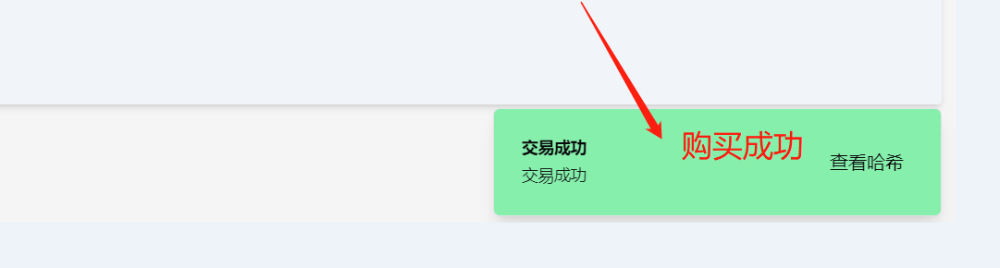
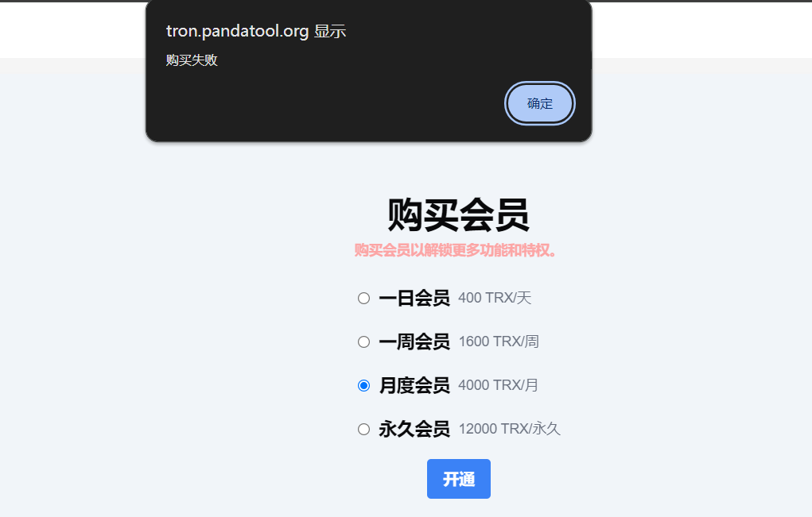
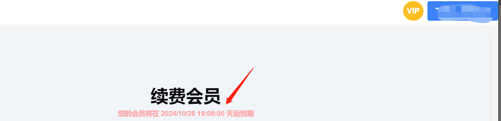
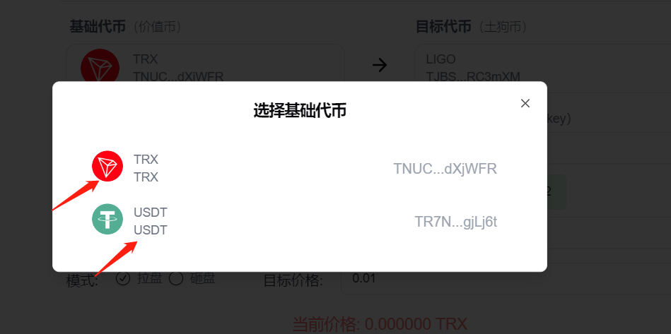
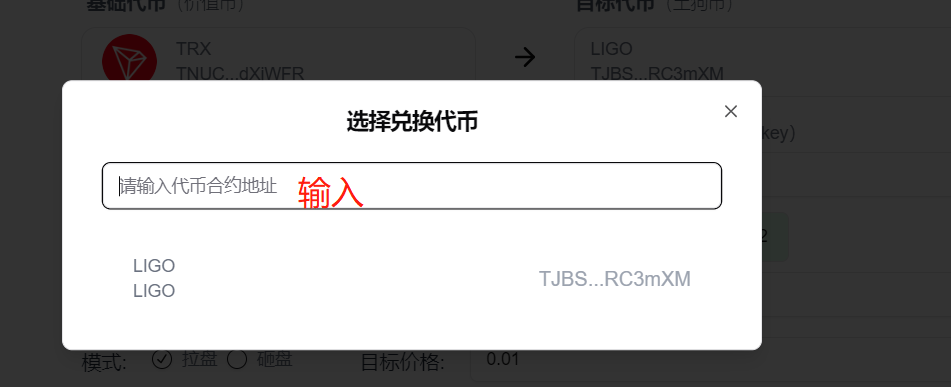

# 波场Tron市值管理机器人使用教程

Tron市值管理机器人，简单来说就是基于波场链开发的自动交易、批量交易的机器人系统，可以按照设定好的目标价格进行买卖

## 一、注意事项 

1、 机器人为`单路由`模式：即，TRX的池子，只能用TRX交易。USDT的池子，只能用USDCT交易

2、 机器人目前只支持Sunswap V2 ，不支持Sunwap V1或者V3池子，也不支持Sunpump

3、 刚开盘项目价格不稳定，往往需要`提高滑点`才能交易成功

4、交易失败的大部分原因都是这几种：余额不够（查看参数是否填写错误）、没有按照流程操作（比如没查池子就开始交易）、矿工费较低（可以增加矿工费）、池子或者交易对的选择错误

<figure><figcaption></figcaption></figure>

## 二、TRX市值管理使用教程 

### 1.钱包连接并购买会员

打开市值管理机器人页面：[https://tron.pandatool.org/trx](https://tron.pandatool.org/trx)，右上角连接钱包（如果没有安装TronLink钱包，可以看 → [波宝钱包安装教程](tronlink.md)）

<figure><figcaption>
链接钱包
</figcaption></figure>

<figure><figcaption>
点击连接
</figcaption></figure>

连接成功后，就可以在右上角看到自己的钱包地址

<figure><figcaption></figcaption></figure>

之后我们点击左侧的购买会员按钮，先进行会员购买，之后才能使用机器人

<figure><figcaption></figcaption></figure>

选择你要购买的会员期限，如我选择月度会员，则需要4000TRX

<figure><figcaption></figcaption></figure>

确定好后，点击开通，会跳出钱包进行确认。如果钱包内余额充足，支付成功后会有以下提示

<figure><figcaption></figcaption></figure>

如果钱包内余额不够，那么就会提示购买失败

<figure><figcaption></figcaption></figure>

如果你成功付款了，可以在会员页面看到你的到期时间

<figure><figcaption></figcaption></figure>

成功购买会员后，接下来就可以进行市值交易操作了

### 2.使用市值机器人

我们回到TRX市值机器人主页，操作流程如下图所示

<figure><figcaption></figcaption></figure>

**1.导入钱包：**导入你的钱包私钥，可以选择同时导入多个地址

<figure><figcaption></figcaption></figure>

**2.刷新余额：**导入之后刷新余额，看下目前你钱包内的代币情况

**3.基础代币：**如果是U池子就选择U，TRX池子就选择TRX

<figure><figcaption></figcaption></figure>

**4.目标代币：**就是你要交易的代币，土狗币，输入合约地址查询

<figure><figcaption></figcaption></figure>

**5.交易间隔：**每一笔交易之间的间隔时间，以秒为单位&#x20;

**6\~7 选择金额：**可以选择全部、随机和固定金额三个方式。

注意：如果是拉盘模式，那么金额就是TRX或者USDT的数量。如果是砸盘模式，则是土狗币的数量

**8.选择模式**

* 拉盘模式→买入代币
* 砸盘模式→卖出代币

**9.设置目标价格：**拉盘模式下，目标价格要高于当前代币价格。砸盘模式下，目标价格要低于当前代币价格&#x20;

**10.查池子：**查询池子地址和代币价格&#x20;

**11.开始：**点击开始操作&#x20;

**12.停止：**停止操作

## 三、疑问解答 

**1、平台会拿到你的私钥吗？**

* 答：绝对不可能，你的私钥不会存储在平台上，所有操作都是基于前端执行的，请放心使用。如果你比较担心，可以使用新的钱包操作

**2、市值管理是收费的吗？**

* 答：需要购买会员才能使用

**3、最多可以导入多少钱包？**

* 答：为了确保操作的稳定性和流畅性，一次性导入的钱包数量最好低于100个

**4、这个机器人能冲土狗吗？**

* 答：市值管理机器人是为了项目方控盘用的，不是用来开盘冲土狗的。尽管可以用它来进行交易，但是并不会像市面上的PEPE BOT一样可以快速买入卖出，暂时没有这个功能

**5、为什么查不到我的池子？**

* 答：请确认您的代币是否在Sunswap V2上线的，并确认交易对是否正确

如有不明白或者不清楚的地方，请加入官方电报群：[https://t.me/PandaTool](https://t.me/PandaTool)

