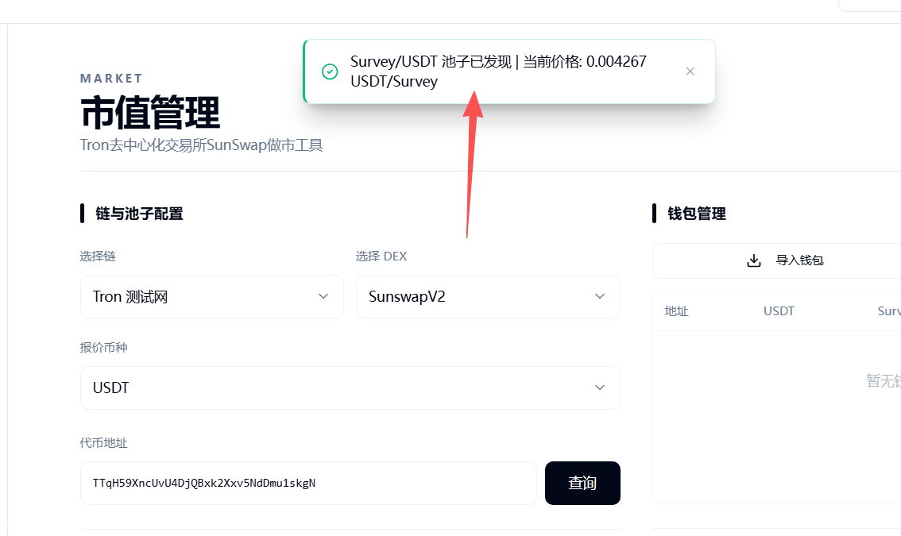
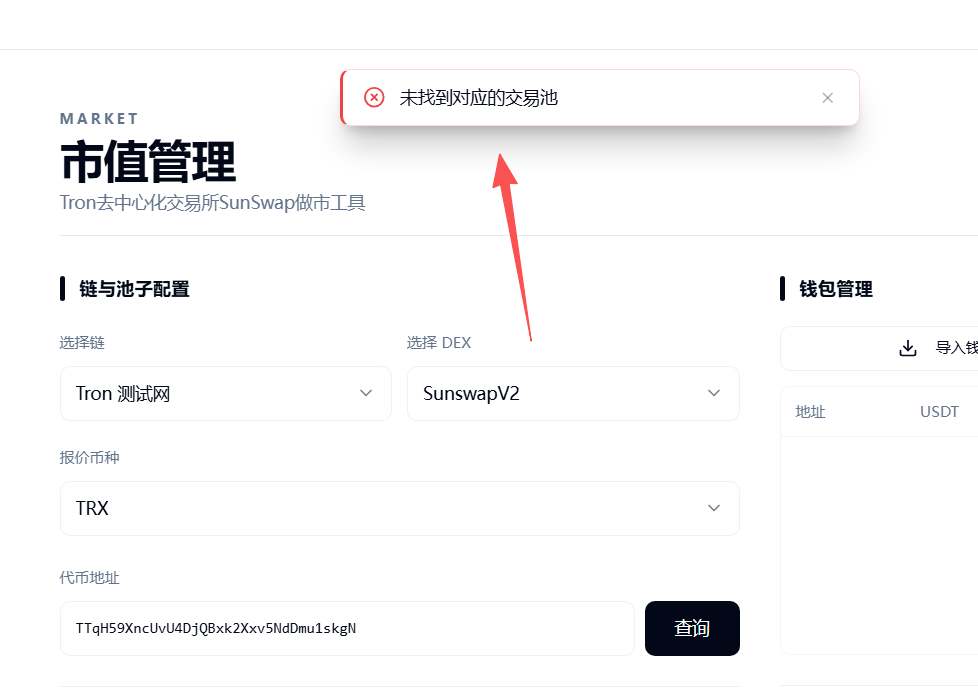
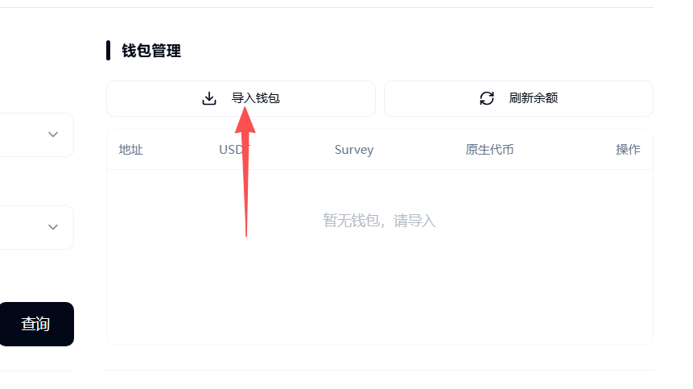
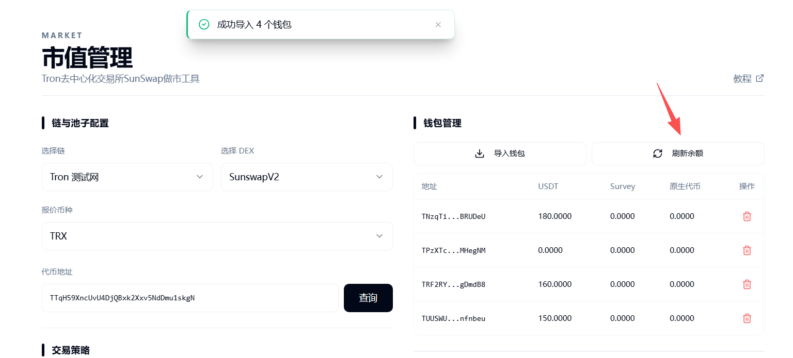
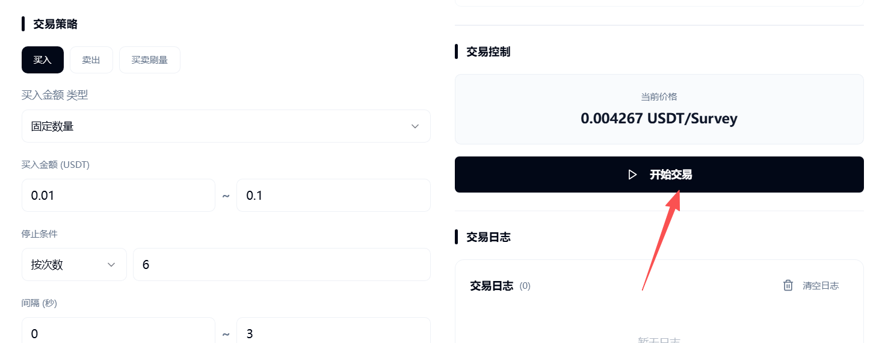
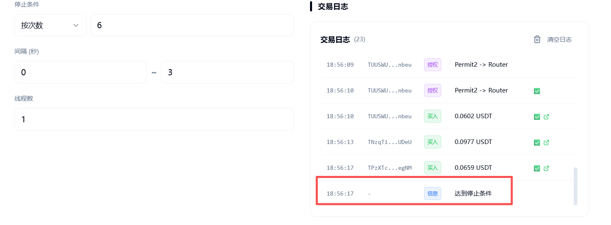
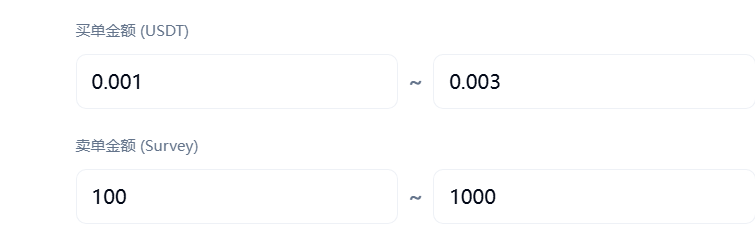
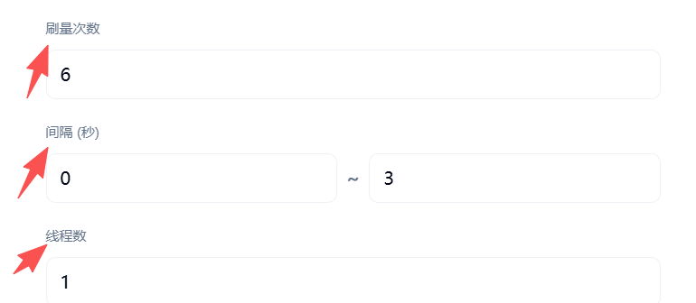

# 波场Tron市值管理机器人使用教程

Tron市值管理机器人，简单来说就是基于波场链开发的自动交易、批量交易的机器人系统，可以按照设定好的目标价格进行买卖

## 一、注意事项 

1、 机器人为`单路由`模式：即，TRX的池子，只能用TRX交易。USDT的池子，只能用USDCT交易

2、 机器人目前只支持Sunswap V2 和V3池子，但不支持Sunpump

3、 刚开盘项目价格不稳定，往往需要`提高滑点`才能交易成功

4、交易失败的大部分原因都是这几种：余额不够（查看参数是否填写错误）、没有按照流程操作（比如没查池子就开始交易）、矿工费较低（可以增加矿工费）、池子或者交易对的选择错误

## 二、TRX市值管理使用教程 

### 1.钱包连接

打开市值管理机器人页面：[https://tron.pandatool.org/zh-CN/sunswap](https://tron.pandatool.org/zh-CN/sunswap)，右上角连接钱包（如果没有安装TronLink钱包，可以看 → [波宝钱包安装教程](tronlink.md)）

<figure><figcaption></figcaption></figure>

连接成功后，就可以在右上角看到自己的钱包地址

### 2.查询资金池

第一步，我们需要配置基础的信息，包括链、代币等：

<figure><figcaption></figcaption></figure>

* **选择链：**&#x9009;择您要交易的区块链，目标代币在哪条链，就选择哪条链
* **交易所：**&#x9009;择您创建的资金池类型，主要是V2和V3的区别
* **报价代币：**&#x5C31;是您的资金池代币，一般是TRX和USDT两种，看下您的资金池交易对
* **代币地址：**&#x60A8;要交易的目标代币地址，直接填进来

确定好信息填写无误后，我们点击**查询**：

* 如果查询没问题，则页面右边会出现代币的价格，并提示您池子已经发现

<figure><figcaption></figcaption></figure>

如果查询有问题，会提示您未找到对应的交易池。这个时候，您需要核对选择的区块链或者交易所是否正确

<figure><figcaption></figcaption></figure>

### **3、导入钱包**

查到资金池和价格后，我们点击右边的按钮导入钱包（私钥）

<figure><figcaption></figcaption></figure>

在弹出的页面输入钱包的私钥，一行一个，然后点击导入私钥。（一般导入几十个就可以了）

<figure><figcaption></figcaption></figure>

钱包导入之后，我们就能看到各个钱包地址了，然后点击**刷新余额**，确认一下钱包内的代币情况

<figure><figcaption></figcaption></figure>

### **4、买入与卖出交易策略**

目前代币的交易方式有三种，分别是：**买入交易、卖出交易和刷量交易，**&#x540C;时会选择不同的操作类型。现在我们了解一下买入和卖出的交易设置

**金额类型（使用买入和卖出同理）**

* **按照数量：**&#x8BBE;定每笔交易的买入数量，以报价代币计算（如USDT，BNB等）
* **按照比例：**&#x8BBE;定每笔交易钱包支出的余额比例
* **范围：**&#x8BBE;定交易数量或者比例的范围

**关于比例：**&#x8FD9;个比例是钱包余额的比例。如果您设置1%，钱包内1000U的话，那么第一笔交易就是10U。此时钱包内只有990U了，那么第二笔交易就是9.9U，以此类推

**停止类型（买入和卖出同理）**

* **按价格：**&#x5C31;是到了某个价格，停止交易
* **按次数：**&#x4EA4;易了多少次之后，就停止交易
* **间隔：**&#x6BCF;一笔交易的间隔时间，以秒为单位
* **线程数：**&#x540C;一秒发起多少笔交易，线程越大，交易频率越高（最大为6）

**设置案例**

例如我填写的代币交易设置是这样的：

这是一笔批量买入的交易，每次买入的金额是0.01USDT到0.1USDT之间。一共交易6次就停止，每次交易间隔时间为0\~3秒，不固定，线程数是1

设定完成后，我点击右边的开启交易按钮，即可开始交易

<figure><figcaption></figcaption></figure>

从交易日志可以看到，一旦达到停止条件，会自动停止交易。

<figure><figcaption></figcaption></figure>

### **5、买卖交易设置**

不同于前面两种针对某个方向的交易，买卖交易指的是自动实现买和卖两种交易方式。

**金额类型（仅支持按数量交易）**

* **按数量：**&#x8F93;入您要交易的代币数量范围
* ~~**按比例：**&#x8BBE;定每笔交易钱包支出的余额比例~~

**买卖概率**

* **买单概率：**&#x7CFB;统发起一笔交易时，这笔交易是**买单**的概率有多大
* **卖单概率：**&#x7CFB;统发起一笔交易时，这笔交易是**卖单**的概率有多大
* 买单概率与卖单概率相加为100%

**数量设置**

* **买入：**&#x8BBE;置每笔买单的买入数量范围（如果数字一样，则为固定数量）
* **卖出：**&#x8BBE;置每笔卖单的卖出数量范围（如果数字一样，则为固定数量）

<figure><figcaption></figcaption></figure>

**停止方式（设置交易次数）**

* **按次数：**&#x5F53;买卖笔数达到多少笔时停止交易
* ~~**按价格：**&#x8FBE;到多少价格时停止交易~~
* **间隔：**&#x6BCF;一笔交易的间隔时间，以秒为单位
* **线程数：**&#x540C;一秒发起多少笔交易，线程越大，交易频率越高（最大为6）

<figure><figcaption></figcaption></figure>

设定完成后，我点击右边的开启交易按钮，即可**开始交易**

<figure><figcaption></figcaption></figure>

## 三、疑问解答 

**1、平台会拿到你的私钥吗？**

* 答：绝对不可能，你的私钥不会存储在平台上，所有操作都是基于前端执行的，请放心使用。如果你比较担心，可以使用新的钱包操作

**2、市值管理是收费的吗？**

* 答：每笔交易收取1TRX的手续费

**3、最多可以导入多少钱包？**

* 答：为了确保操作的稳定性和流畅性，一次性导入的钱包数量最好低于100个

**4、这个机器人能冲土狗吗？**

* 答：市值管理机器人是为了项目方控盘用的，不是用来开盘冲土狗的。尽管可以用它来进行交易，但是并不会像市面上的PEPE BOT一样可以快速买入卖出，暂时没有这个功能

**5、代币地址没有错，为什么提示错误？**

* **答：**&#x5982;果确认代币地址没有错，那么可能是您选择的区块链错误，或者是交易所资金池类型错误

**6、为什么会交易失败？**

* **答：**&#x901A;常的原因是钱包内Gas不足或者代币余额不足导致的

如果您在TRX市值管理工具的运行过程中，遇到了无法解决或者不清楚的地方，可以在PandaTool的官方交流群联系客服处理：[https://t.me/pandatool](https://t.me/pandatool)
