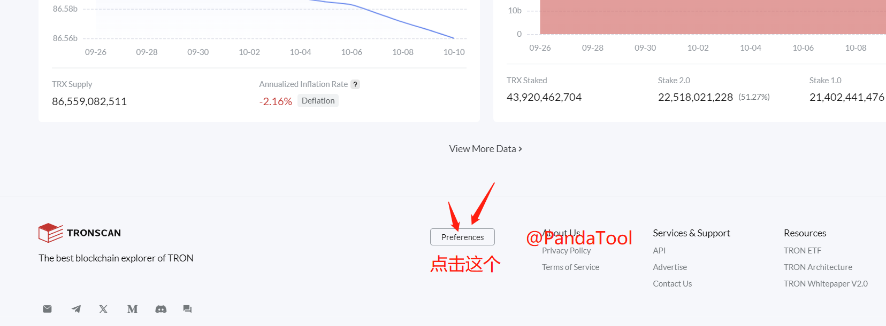
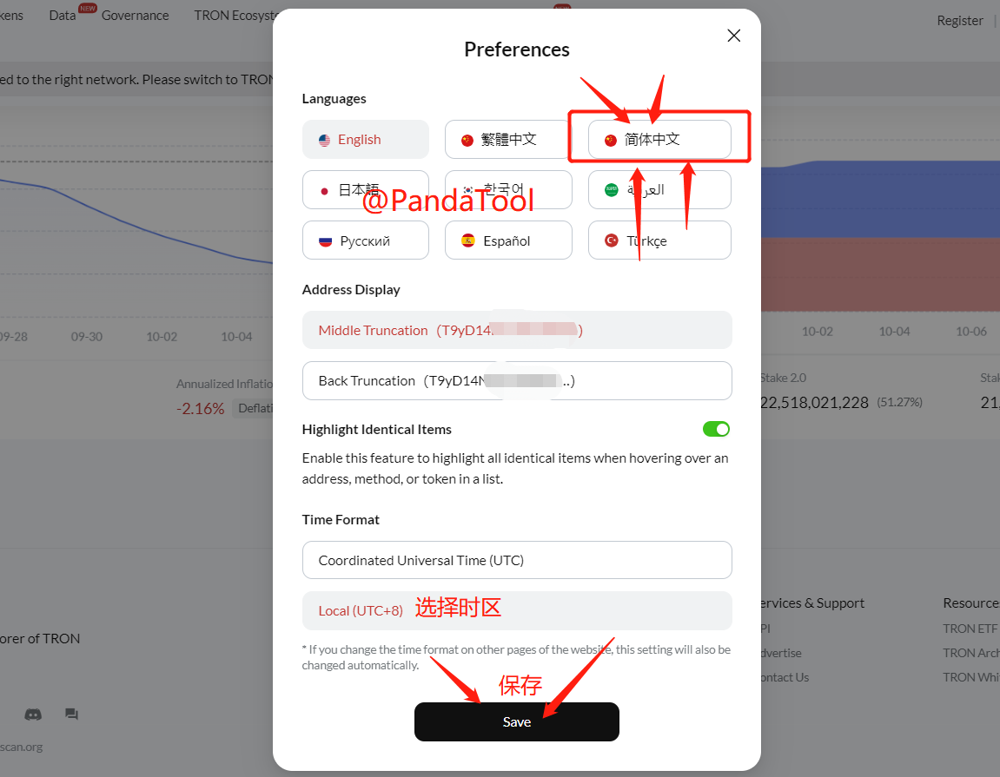
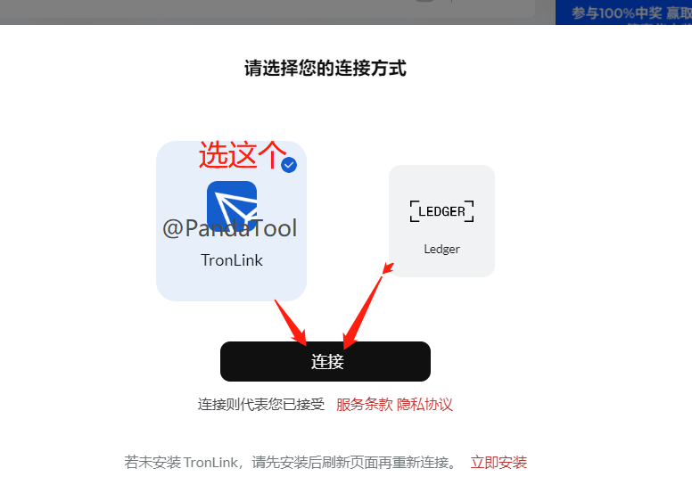
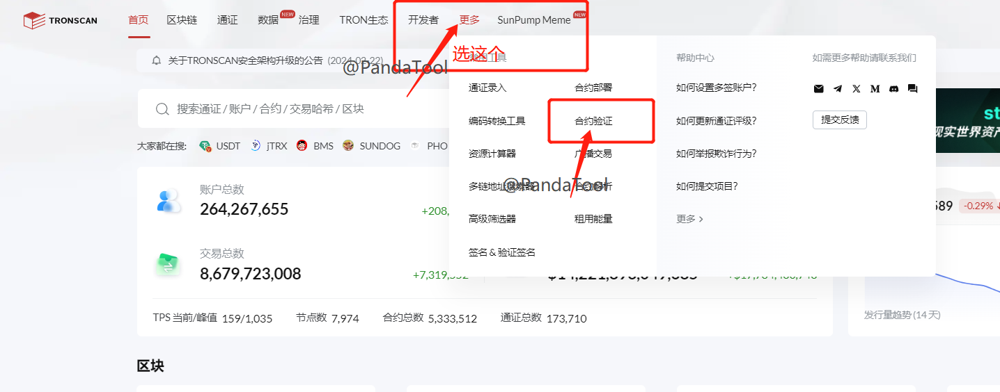
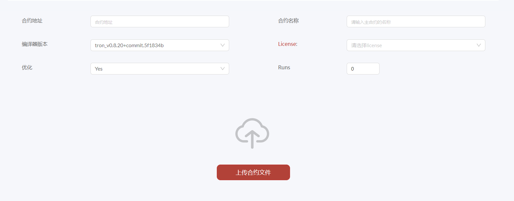
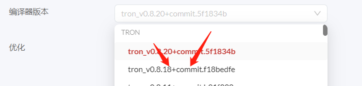
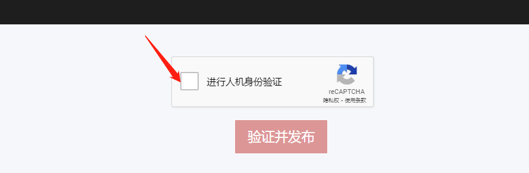
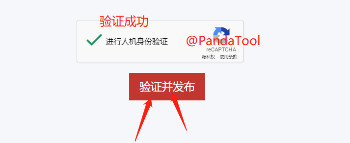
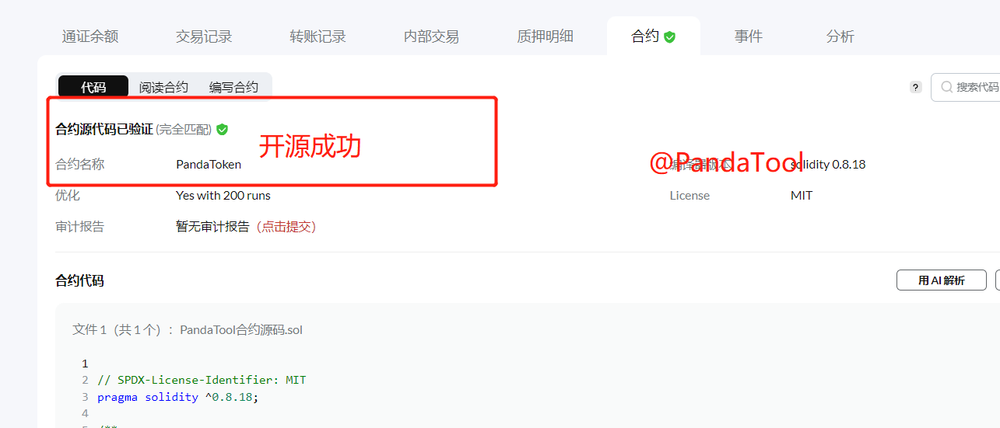
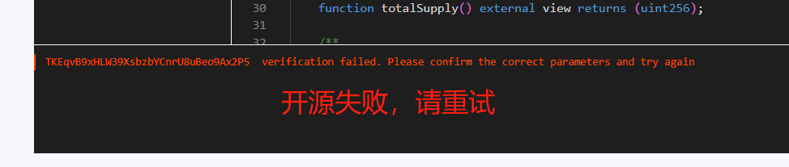

# 波场代币合约验证和开源教程

所谓合约验证，就是在波场官方浏览器上将合约源码上传，并与已经发行的代币进行匹配，由此对合约进行开源。开源后的代币，透明性更强，也更容易受到认可。

所有在PandaTool发行的波场TRC20代币，都可以参考这个教程进行开源。


代币验证之前，必须先下载合约文件




### 一、找到开源入口

首先，我们需要在波场官方浏览器找到开源入口。打开浏览器链接：[https://tronscan.org/](https://tronscan.org/) ，什么都别管，先设置语言。

将浏览器拉到底部位置，找到**Preferences** 点击进行偏好设置

<figure><figcaption></figcaption></figure>

之后在出现的设置里选择中文，点击Save保存即可

<figure><figcaption></figcaption></figure>

当浏览器变为中文后，我们点击右上角连接钱包，登陆上浏览器

<figure><figcaption></figcaption></figure>

<figure><figcaption></figcaption></figure>

钱包连接成功后，我们在顶部菜单栏找到【**更多**】，然后在出现的功能列表里选择【**合约验证**】，就可以了

<figure><figcaption></figcaption></figure>

### 二、填写开源参数并上传源码

在合约开源页面，我们能看到这样的信息

<figure><figcaption></figcaption></figure>

如果你觉得懵逼，不要紧，接下来我一 一教大家该怎么填写

* **合约地址：**这个很好理解，就是你的代币地址
* **合约名称：**这个填 **PandaToken** （注意大小写也不能错）
* **编译器版本：**选择tron\_v0.8.18

<figure><figcaption></figcaption></figure>

* **License：**选择MIT
* **优化：**Yes
* **Runs：200**

大家需要注意的是，除了合约地址是你们自己的以外，其他的全部都不能错。例如我填写的信息大概是这样的：

<figure><figcaption></figcaption></figure>

参数填写完成之后，就是上传合约文件。我们将刚刚下载的合约文件传到来，如果没有下载，可以点击这里下载



合约文件上传成功，就可以看到源码了

<figure><figcaption></figcaption></figure>

### 三、验证并发布

文件上传后，将页面往下拉，能发现一个人机验证的提示，点击进行谷歌人机验证

<figure><figcaption></figcaption></figure>

人机验证完成，点击**【验证并发布】**

<figure><figcaption></figcaption></figure>

等待几秒钟，如果开源成功，会给你跳转到一个新的页面，可以看到你的合约源码

<figure><figcaption></figcaption></figure>

如果开源失败，会给出下图的提示

<figure><figcaption></figcaption></figure>

此时你需要再去检查一下，看看开源参数是不是填写正确了。重新填写之后，再刷新页面重试

### 四、疑问解答

1、合约开源需要付费吗？

* **答：**不需要，合约开源不会收取任何费用

2、任何人都能开源吗？

* **答：**是的，只要有这套源码且参数填对的话，任何人都能按照这个流程开源

3、为什么我没有看到**人机验证**？

* **答：**谷歌人机验证必须在开启梯子的前提下才会有，请检查网络是否正确

如果您有其他问题，还可以进入Telegram电报群找志愿者解答： [https://t.me/pandatool](https://t.me/pandatool)
